title: "Od moru ke covidu: unikátní data, jak se měnily příčiny úmrtí Čechů od císaře pána do dneška"
perex: "<i>S covidem</i>, nebo <i>na covid</i>? Na otázku, která na jaře zamotala hlavu celé civilizaci – tedy co považovat za příčinu úmrtí – hledá medicína odpověď přes sto let."
coverimg: assets/0_uvodni_ilustrace.jpg
coverimg_note: ""
styles: [https://fonts.googleapis.com/css2?family=Fira+Sans:wght@300;400;500;600]
libraries: [] #jquery, d3, highcharts, datatables
options: [] #wide, noheader (, nopic)
---

Představte si situaci: pacient, který se celoživotně léčí s cukrovkou, se nakazí koronavirem covid-19 a jeho následkem zemře. Jaká je příčina smrti? Diabetes, nebo covid?

Pod svícnem pandemie se zdá jasné, že koronavirus. Jenže bez souběžných zdravotních problémů – _komorbidit_ – nemoc zabíjí málokdy.

Přesvědčivě to dokládají data o 407 zemřelých během první poloviny roku 2020 s pozitivním testem na covid. Ministr zdravotnictví Jan Blatný při [prezentaci závěrů](https://www.facebook.com/watch/?v=411624583222188) dosud nezveřejněné studie rozdělil oběti do tří skupin:
- 27 procent zemřelo na covid
- 9 procent podlehlo spíš akutní příčině, například infarktu nebo úrazu
- 64 procent mělo kromě covidu jinou chronickou nemoc, obvykle srdeční poruchu, diabetes nebo zhoubný nádor

<wide>
  <figure id="graf-komorbidity" class="priciny-umrti-vis-static">
    
    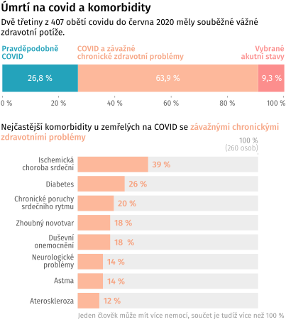
    

      Zdroj: <a href="https://koronavirus.mzcr.cz/wp-content/uploads/2020/11/Data-o-celkov%C3%A9-mortalit%C4%9B-a-o-p%C5%99%C3%AD%C4%8Din%C3%A1ch-%C3%BAmrt%C3%AD-pacient%C5%AF-s-covid-19.pdf">Data o celkové mortalitě a o příčinách úmrtí pacientů s COVID-19, prezentace MZ ČR</a>
    

  </figure>
</wide>

U prvních dvou skupin má otázka po příčině úmrtí jednoznačnou odpověď. Jenže u poslední – a největší – skupiny taková odpověď prostě neexistuje. Medicína se proto nejméně od první světové války snaží na základě dobových vědeckých poznatků rozhodnout, které z nemocí smrt spíše připsat.

Nejde vůbec o akademický spor: odpověď často ovlivní rozvoj medicíny na desítky let dopředu. Nemoci, které se mezi příčinami úmrtí objevují nejčastěji, mají také největší pozornost odborné komunity. Ta se zase často přeleje do rozpočtů.

Lékařská statistika většinou předpokládá, že příčina úmrtí je jen jedna. Mají lékaři při rozhodování, zda zabíjel diabetes či covid, upřednostnit dlouhodobé zdravotní potíže, nebo krátkou intenzivní nemoc? Ať už zvolí jedno nebo druhé, pak nutně zmizí část informace.

_Příčina úmrtí: covid-19_ skrývá, že jde o pacienta s dlouhodobými potížemi. Opačný případ, kdy by statistika upřednostnila diabetes, zase opomíjí fakt, že bez covidu by žil podstatně déle. Podle lékařů není výjimka, když virus zkrátí život o deset i dvacet let.

Nahraďte koronavirus v příkladu chřipkou a máte představu o dilematu, se kterým se zdravotnictví musí vypořádat. Zabíjela cukrovka, nebo chřipka?

Dnešní medicína nastavuje pravidla pro rozhodování, ale odpověď nechává na lékaři. U chřipky bude opatrnější – nakažlivé nemoci považuje za celospolečenské riziko, stejně jako v dobách, kdy řádila cholera nebo pravé neštovice. Poslední rok možná překvapivě ukázal, že oprávněně: dnešní společnost je vůči epidemiím podobně křehká jako před dvěma sty lety.

Pokud chceme pochopit, co znamená _na covid_ nebo _s covidem_, zda má smysl srovnávat počty obětí mezi zeměmi a co vlastně spojení _příčina úmrtí_ doopravdy znamená, musíme se vrátit ještě do doby, kdy byly české země součástí Svaté říše Římské a ve stínu morových ran se moderní epidemiologie teprve rodila.

<wide>
  

    
    
    
    
    
    
    
  

</wide>

<h2 class="priciny-umrti-nadpis-kapitoly">Od faráře k demografovi: jak se umíralo za císaře pána</h2>
<h2 class="priciny-umrti-podnadpis-kapitoly">1785 až 1918</h2>

Neuvěřitelně působí fakt, že ještě před dvěma sty lety se naši předci dožívali podobného věku jako ve středověku – průměrně méně než třiceti let. Na základě kosterních nálezů odhadují historici naději dožití v osmém století u kmenů, které žily na dnešním českém území, na 27,5 roku. O tisíc let později to bylo podle císařských dat 28,2 roku.

Když na úvod článku trochu předběhneme, během necelých dvou století se délka života protáhla z 28 na bezmála 80 let. Nešlo o plynulou změnu: jsou období jako přelom 19. a 20. století, kdy se během jedné generace život prodloužil o 40 procent, světové válce navzdory. V jiných dobách se růst délky života zpomalil nebo zastavil. V komunistických 60. letech minulého století se dokonce na celé desetiletí obrátil, hlavně u mužů.

<wide>
  <figure id="graf-nadeje-doziti-celek" class="priciny-umrti-vis-static">
    
    
    

      Zdroj: Vladimír Srb: 1000 let obyvatelstva českých zemí, <a href="https://www.czso.cz/csu/czso/demograficka-prirucka">Demografická příručka ČSÚ</a>
    

  </figure>
</wide>

  

    

      
Ukazatele délky života

      

        <em>Naděje dožití</em>, <em>střední délka života</em>, <em>očekávaná délka dožití při narození</em>. Všechny tři termíny označují totéž, obvykle se interpretují jako očekávaná délka života za předpokladu, že by se nezměnily podmínky úmrtnosti. Ve skutečnosti se ale mění, každá další generace se dožívá vyššího věku než ta předchozí. Zmíněné ukazatele tedy mluví spíš o těch, kteří svět opouští, než o nově příchozích.
      

    

  

S délkou života úzce souvisí méně příjemný ukazatel: míra úmrtnosti. Nejde přímo o převrácenou hodnotu, ale s trochou zjednodušení můžeme říct, že délka dožití roste, když míra úmrtnosti klesá. V každém historickém období se přitom příčiny úmrtí mění. Za císaře, během první republiky obklíčené válkami, za komunistické totality i po sametové revoluci rozhodovaly o délce a kvalitě života jiné nemoci, nehody nebo násilná úmrtí.

Důvod, proč začali panovníci hlídat, kolik a jak starých poddaných mají, byly války. Důvod, proč začali sledovat, na co umírají, epidemie.

V sedmnáctém století Evropu děsil mor. Z té doby pocházejí [první ručně kreslené úmrtnostní tabulky](https://en.wikisource.org/wiki/Natural_and_Political_Observations_Made_upon_the_Bills_of_Mortality_(Graunt_1676)) a pokusy odhadnout dětskou úmrtnost. Jejich autor, Londýňan John Graunt, je považován za zakladatele demografie i moderní epidemiologie jako vědy o zdraví populace.

Na konci osmnáctého století, kdy vědecká novinka dorazila do Vídně, centra Svaté říše Římské, už morové rány odezněly. Místo moru teď křižovaly Evropu vlny pravých neštovic, cholery a záškrtu.

Prvními demografy byli v českých zemích kněží. _Církevní výkazy o konskribovaných duších_, jak se dokument nazýval, evidovaly v každé farnosti sňatky, narození a úmrtí od roku 1762. Jejich čísla se bohužel nedochovala.

Zmiňuje to v knize _Tisíc let obyvatelstva českých zemí_ [pozoruhodný demograf Vladimír Srb](https://encyklopedie.soc.cas.cz/w/Srb_Vladim%C3%ADr), který z historických pramenů zrekonstruoval primární data a zmapoval historické souvislosti. Z jeho publikací čerpáme v historických kapitolách.

O dvacet let později církevní proto-demografii okopírovala světská moc. Úřední evidenci obyvatel zavedl osvícenský císař Josef II., syn Marie Terezie, patentem z roku 1784. Šlo o součást _josefínských reforem_, které měly za cíl centralizovat říši a racionalizovat vládnutí. Dalším opatřením byla povinná psí vodítka.

Patent předpokládal také vznik evidence příčin úmrtí. Primárním cílem statistiky bylo včas odhalit a zastavit epidemie, k tomu jí stačilo rozlišovat jen několik základních příčin smrti: _nemoci obyčejné (gewöhnliche), místní (Ortskrankheit)_ a _epidemické, sebevraždy, vraždy_ a _úrazy_.

„Pokud jde o epidemické nemoci, byl největší zájem věnován neštovicím a choleře,“ píše Srb. „V roce 1808 vyšel dvorský dekret, který předpisoval lékařům hlášení hromadného výskytu úmrtí v obci na stejnou, ale kteroukoliv nemoc nadřízeným úřadům. Byla to jakási primitivní epidemiologická ohlašovací služba.“

<figure>
  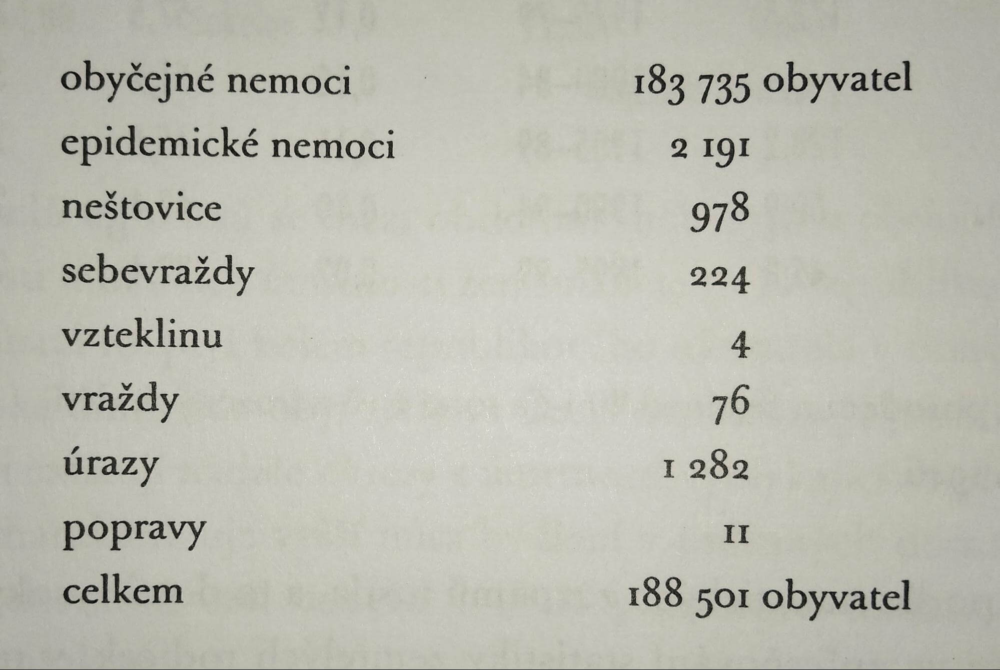
  <figcaption>Nejstarší dochovaná data o příčinách úmrtí, rok 1828</figcaption>
</figure>

Až do první světové války přesnější rozlišení příčin úmrtí chybí. Poměrně spolehlivá jsou ale data o počtu narozených a zemřelých. Z výkyvů umíme poměrně dobře odhadnout, které události život zkracovaly. O největší zuby v lince úmrtnosti se v 19. století postaraly napoleonské války, epidemie neštovic a záškrtu, a také revoluční rok 1848. Více narozených dětí po válce zase naznačuje, jak jsou v této době obě linky provázané: zemřelé bylo třeba „nahradit“ dětmi. Vysoká kojenecká a dětská úmrtnost znamenala vysokou porodnost.

Snížení úmrtnosti na konci století pak znamenalo také méně dětí – [stejný trend](https://www.irozhlas.cz/zivotni-styl/spolecnost/datova-zurnalistika-faktomluva-hans-rosling_1811270630_zlo), který v knize Faktomluva popisuje demograf Hans Rösling v souvislosti se zeměmi třetího světa.

<wide>
  <figure id="graf-narozeni-zemreli" class="priciny-umrti-vis-static">
    
    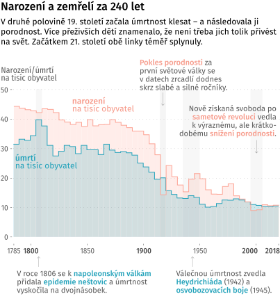
    

      Zdroj: Vladimír Srb: 1000 let obyvatelstva českých zemí, <a href="https://www.czso.cz/csu/czso/demograficka-prirucka">Demografická příručka ČSÚ</a>
    

  </figure>
</wide>

Jedním z nejúspěšnějších období, co se týče prodloužení délky života, je přelom 19. a 20. století. Během jedné generace se – navzdory válce – život v českých zemích prodloužil o 40 procent.

Klíčem k tomuto prvnímu zlomu v délce života byl zrod veřejného zdravotnictví v 80. letech 19. století. Experiment s všeobecnou zdravotní péčí si císař nejprve otestoval v koutě říše – na Moravě. Úmrtnost na infekční nemoci se zde následně propadla na polovinu a experiment se z periferie rozšířil do průmyslových center rakouského mocnářství.

První světová válka si mezi Čechy, Moravany a Slezany vyžádala asi [200 tisíc vojenských obětí](https://www.dotyk.cz/publicistika/na-frontach-1-svetove-valky-padlo-kolem-200-tisic-cechu-odhaduje-statistik-20181113.html), které ovšem v oficiální c. a k. statistice chybí. S odhadem počtu obětí přišli historici a demografové až zpětně. Pomohly jim nepřímé metody jako sčítání vdov po padlých.

Podle Srba jsou ovšem pro české země demograficky podstatnější nepřímé oběti: odhaduje, že kvůli válce [nepřišlo na svět 910 tisíc dětí](https://www.czso.cz/csu/czso/demograficky_obraz_zemi_koruny_ceske_za_prvni_svetove_valky_v_publikaci_csu) neboli 8,8 procenta předválečné populace.

Slabé válečné ročníky se zařezávají do statistiky dodnes: trend, kdy jsou české školky několik let poloprázdné a vzápětí přeplněné, spustilo právě rozkolísání dlouhodobě stabilní porodnosti za první světové války. Později se k nim přidala husákovská propopulační opatření a odklad plodnosti po sametové revoluci. Problém s nenarozenými válečnými dětmi řeší většina evropských zemí; u některých se ještě prohloubil za druhé války, nejpalčivěji chybějící generaci [vnímá Rusko](https://www.irozhlas.cz/zpravy-svet/rusove-proti-rusum-zeme-v-nevyhlasene-obcanske-valce_1504291200_zlo).

<wide>
  

    
    
    
    
    
    
  

</wide>

<h2 class="priciny-umrti-nadpis-kapitoly">Od španělské chřipky k německému exodu</h2>
<h2 class="priciny-umrti-podnadpis-kapitoly">1919 až 1948</h2>

V posledním válečném roce zasáhla Evropu pandemie španělské chřipky s [násobně vyšším počtem obětí](https://www.czso.cz/documents/10180/123310412/13005320q3_salfellner.pdf/cdb4e701-2f63-4182-be7d-e8c998a9a830?version=1.1) než samotná válka. Vzápětí se úmrtnost zásadně snížila: ještě v roce 1919 zemřelo v české kotlině téměř 180 tisíc lidí, o čtyři roky později 142 tisíc. Na nižší hladině úmrtnost zůstala po většinu první republiky.

Největší zlepšení v poválečných letech zaznamenala úmrtnost na infekce a nemoci dýchací soustavy. Obojí souvisí s válečnými roky, únavou rakouského hospodářství, a hlavně právě španělskou chřipkou.

Víme to díky tomu, že Československo – v rámci loučení se se vším rakouským – spustilo revoluci také v demografii. Málo podrobnou císařskou statistiku Čechoslováci nahradili, podobně jako v řadě dalších evropských zemí, propracovanější _Mezinárodní klasifikací nemocí (MKN)_. U ní se na chvíli zastavíme: dnes, o sto let později, je totiž [základem zdravotnické statistiky celé planety](https://www.youtube.com/watch?v=tZFcoYfnwiM).

  

    

      
      
Podivné diagnózy

      

        <em>Sešlost stařecká se zblbělostí</em>, <em>zrůdnost vrozená</em>, <em>vrozený nesprávný tvar srdce</em>… Jakkoliv je téma vážné, některé diagnózy z minulosti dnes působí poněkud poeticky až humorně. Dodnes ovšem najdeme <a href="https://mkn10.uzis.cz/">na seznamu oficiálních diagnóz</a> <em>kousnutí nebo úder psem</em>, <em>uhození se o jinou osobu</em> i <em>nehodu vesmírné lodi</em>.
      

    

  

MKN vznikla roku 1893 a po úspěchu ve Spojených státech se počátkem 20. století začala usazovat v Evropě. Do té doby se systémy lišily nejen stát od státu, ale také město od města, takže statistika úmrtí často nebyla srovnatelná ani v rámci jedné země.

Autoři MKN navíc počítali s tím, že s rozvojem medicíny bude třeba klasifikaci aktualizovat – každých deset let proto chtěli zavést novou revizi s upraveným seznamem nemocí. V roce 1919, kdy statistiku zavádělo Československo, platila druhá revize, označovaná MKN-2.

Příčiny úmrtí jsou v klasifikaci sdružené do nadřazených kapitol, například _infekční nemoci_ nebo _úrazy_. Přesné názvy konkrétních příčin se mezi revizemi často mění, zanikají a vznikají nebo přesunují mezi kapitolami – například _stáří_ jako příčina úmrtí se během celého století přes _stařeckou sešlost_ (_s_ nebo _bez zblbělosti starobní_) a řadu dalších variant obloukem vrátilo k názvu diagnózy _stáří – senilita_. Oproti tomu právě kapitoly většinou zůstávají stabilní. Umožňují tak srovnávat úmrtnost od roku 1919 dodnes.

<wide>
  <figure class="priciny-umrti-vis-static priciny-umrti-top-mkn-diagnozy">
    

      <button type="button" data-mkn="mkn-2" data-mkn-active>
        MKN-2
        1919
        1925
      </button>
      <button type="button" data-mkn="mkn-3">
        MKN-3
        1931
      </button>
      <button type="button" data-mkn="mkn-4">
        MKN-4
        1941
      </button>
      <button type="button" data-mkn="mkn-5">
        MKN-5
        1949
      </button>
      <button type="button" data-mkn="mkn-6">
        MKN-6
        1958
      </button>
      <button type="button" data-mkn="mkn-7">
        MKN-7
        1968
      </button>
      <button type="button" data-mkn="mkn-8">
        MKN-8
        1979
      </button>
      <button type="button" data-mkn="mkn-9">
        MKN-9
        1994
      </button>
      <button type="button" data-mkn="mkn-10-i">
        MKN-10-I
        2007
      </button>
      <button type="button" data-mkn="mkn-10-ii">
        MKN-10-II
        2019
      </button>
    

    

      

        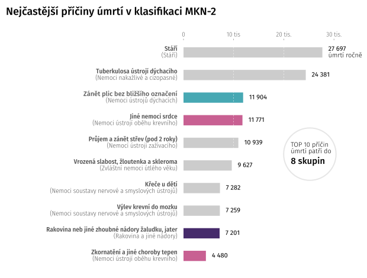
      

      

        
      

      

        
      

      

        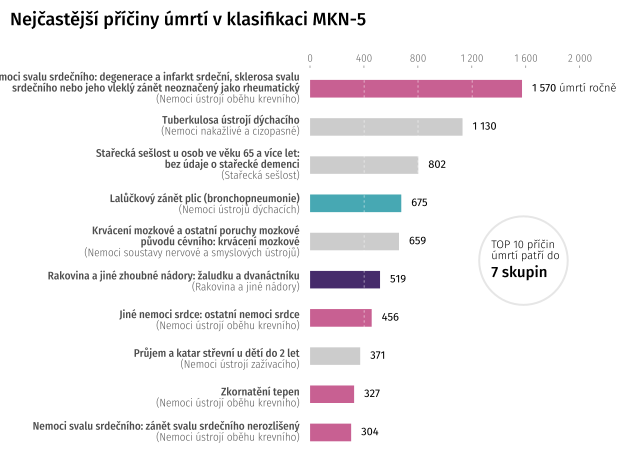
      

      

        
      

      

        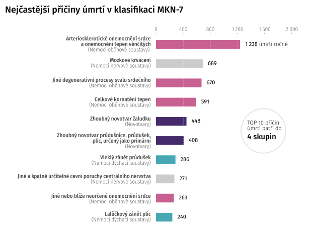
      

      

        
      

      

        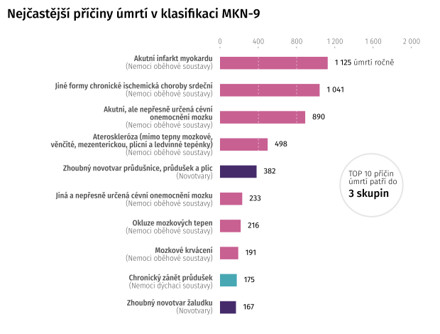
      

      

        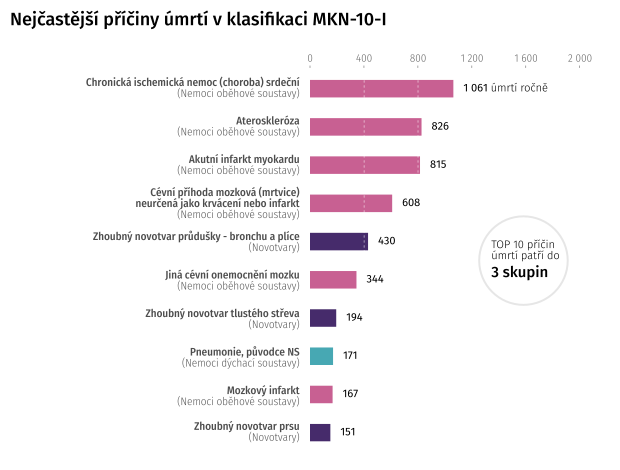
      

      

        
      

    

    

      Zdroj: <a href="https://www.czso.cz/csu/czso/zemreli-podle-podrobneho-seznamu-pricin-smrti-pohlavi-a-veku-v-cr-1919-2005-a95l7hehjg">Zemřelí podle podrobného seznamu příčin smrti, pohlaví a věku, ČSÚ</a>
    

  </figure>
</wide>

<wide>
  

    

      

        
Hrubá míra úmrtnosti

        

          <a href="https://www.czso.cz/csu/czso/zemreli-podle-podrobneho-seznamu-pricin-smrti-pohlavi-a-veku-v-cr-1919-2005-a95l7hehjg">Zdrojová data o příčinách úmrtí</a> ukazují, kolik na jakou příčinu zemřelo lidí. Pokud bychom je pouze spojili do časové řady, abychom ukázali trendy v příčinách úmrtí, narazíme na problém: po roce 1938 přišlo Československo o pohraničí a s ním o část obyvatel. Ze statistik tak zmizely Sudety, s nástupem protektorátu pak i Němci ve vnitrozemí. V absolutních počtech úmrtí je proto po roce 1938 schodek.
        

        

          Proto se počet úmrtí obvykle srovnává s počtem obyvatel území: výsledný ukazatel se nazývá <em>hrubá míra úmrtnosti</em>, ukazuje počet úmrtí na tisíc obyvatel a schodek odstraňuje.
        

      

      

        <!-- TODO: alt text -->
        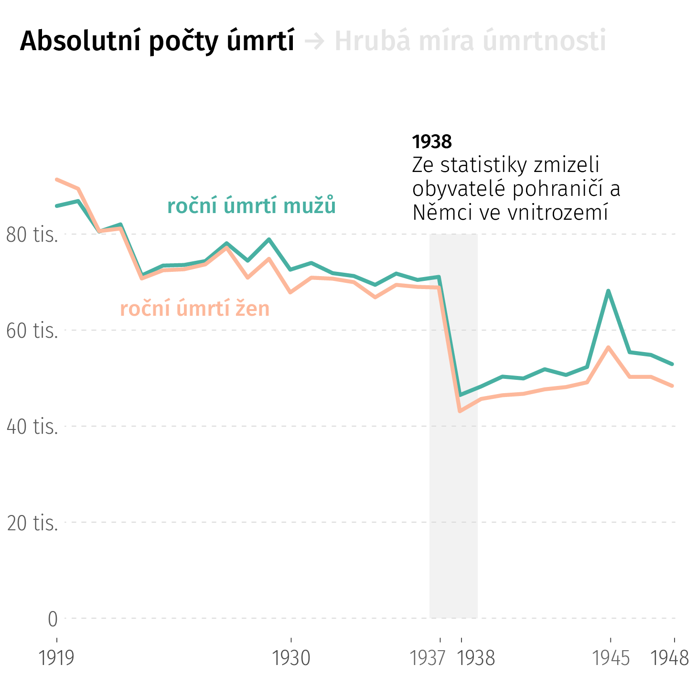
      

    

    

      

        
Standardizovaná míra úmrtnosti

        

          Zároveň se v první polovině 19. století rychle měnila věková struktura: v roce 1920 měli navrch mladí, téměř polovina Čechoslováků měla do 25 let. Během dalších třiceti let ale populace zestárla: o čtvrtinu přibylo seniorů.
        

        

          To má logicky vliv i na statistiku úmrtí. V mladší populaci jsou častěji příčinou úmrtí dětské nemoci, násilná úmrtí nebo nehody, ve starší populaci nemoci srdce a rakovina.
        

        

          Data mají ukazovat změny v úmrtnosti, ne ve věkové struktuře. Proto se u časových řad nebo srovnání více území ještě <em>věkově standardizují</em>: příčiny úmrtí se sledují optikou neměnného věkového rozložení, v našem případě posledního roku časové řady. Grafy tedy budou ukazovat příčiny úmrtí, <em>jako by v celém období platila věková struktura posledního roku řady</em>.
        

      

      

        <!-- TODO: alt text -->
        
      

    

  

</wide>

Prvnímu období, kdy jsou pro české území dostupná podrobná data o příčinách úmrtí, dominují světové války. Období jsme ohraničili zlomovým rokem 1948 – i když v našem případě jde o trochu jiný mezník, než o kterém se obvykle v souvislosti s tímto rokem mluví. Víc prozradíme v další části textu.

<wide>
  

    

      <h3>Propad úmrtnosti za první republiky</h3>
      

        Od konce první světové války do únorového převratu klesla standardizovaná míra úmrtnosti téměř na polovinu: z 2048 na 1141 úmrtí na 100 tisíc obyvatel. Je to i tím, že v prvních letech řádila španělská chřipka.
      

    

    

      <h3>Co za propadem stojí?</h3>
      

        Za první republiky se ustálilo šestnáct skupin přirozených úmrtí – nemocí, vrozených vad, novorozenecké úmrtnosti nebo stařecké sešlosti – a pět skupin vnějších příčin smrti. Těmi jsou vraždy, sebevraždy, válka a popravy, dopravní nehody a úrazy. Ukážou, kde se úmrtnost snižovala a kde naopak rostla.
      

    

    

      <h3>Méně sešlých starců?</h3>
      

        V roce 1919 zemřelo s diagnózou <em>stařecká sešlost</em> 28 tisíc lidí, v roce 1948 jen pět tisíc. Neznamená to, že by v českých zemích ubylo kmetů – jen to, že během první republiky se zpřesnila statistika. Stáří jako příčinu úmrtí lékaři obvykle uváděli, pokud neznali přesný důvod.
      

    

    

      <h3>Posun v léčbě tuberkulózy</h3>
      

        Ještě dlouho po první světové válce byly největším zabijákem nakažlivé nemoci. Kromě krátké epizody se španělskou chřipkou byla zvlášť obávaná tuberkulóza – mezi infekcemi měla na svědomí 60 až 70 procent úmrtí. Během první republiky spadl počet obětí infekcí, hlavně díky zdravotní péči a lepší výživě, ze 44 tisíc na jedenáct tisíc.
      

    

    

      <h3>Být tlustý přestává být výhoda</h3>
      

        Okamžik, kdy nemoci srdce v úmrtnosti přebraly prvenství od infekcí, je pro medicínu důležitý. U tuberkulózy je obezita ochranným faktorem, u nemocí srdce je riziková. Z denního tisku tak ve třicátých letech zmizely populární inzeráty na bonbóny, po kterých spolehlivě ztloustnete.
      

    

    

      <h3>Éra civilizačních chorob</h3>
      

        Rapidní prodloužení života vedlo k vyšší úmrtnosti na takzvané civilizační choroby, typicky nemoci oběhové soustavy a rakovinu. Nemoci srdce dostaly svou kolonku mezi příčinami úmrtí poprvé v roce 1895, na konci dvacátých let už šlo o nejčastější příčinu smrti.
      

    

    

      <h3>Oběti druhé světové války</h3>
      

        Za války v protektorátu dvakrát prudce přibylo násilných úmrtí: v roce 1942 během heydrichiády eviduje oficiální statistika 1 790 popravených, při vojenských akcích na konci války mluví o 14 tisících civilních obětí. V datech chybí deportovaní a ti, které evidovaly říšské úřady: Němci a obyvatelé pohraničí.
      

    

    

      <h3>Muži × ženy</h3>
      

        Většina civilních obětí války byli chlapci a muži. U heydrichiády je poměr mužských a ženských obětí asi 8:1, u osvobozovacích bojů 3:1.
      

    

    

      <h3>Najděte další příběhy sami</h3>
      

        Nyní je graf interaktivní, můžete sledovat kteroukoliv skupinu příčin nebo je srovnávat mezi sebou, měřítko se přizpůsobí. Pro lepší orientaci jsme je rozdělili do tří sekcí. Při kliknutí na skupinu a rok uvidíte několik nejčastějších diagnóz v dobovém pojmenování. Linky ukazují standardizovanou míru úmrtnosti podle věkové struktury populace z roku 1948.
      

    

    

      <svg class="priciny-umrti-pribehy-viz prvni-republika-pribehy-viz"></svg>
    

  

</wide>

Podrobnější pohled prozradí věk válečných obětí nebo v čem je zákeřná tuberkulóza.

<wide>
  <figure id="graf-heatmap" class="priciny-umrti-vis-static">
    
    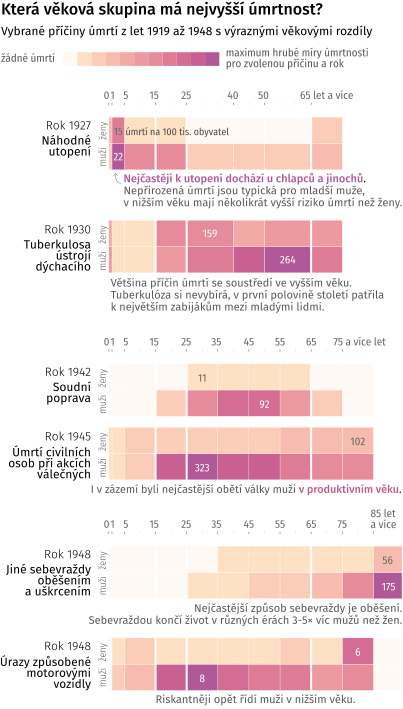
    

      Zdroj: <a href="https://www.czso.cz/csu/czso/zemreli-podle-podrobneho-seznamu-pricin-smrti-pohlavi-a-veku-v-cr-1919-2005-a95l7hehjg">Zemřelí podle podrobného seznamu příčin smrti, pohlaví a věku, ČSÚ</a>
    

  </figure>
</wide>

  

    

      
Dopočítávání německé populace

      

        Téměř celá časová řada mezi lety 1919 a 2018 ukazuje příčiny úmrtí v českých zemích: tedy za Čechy, Moravu a Slezsko. Výjimkou jsou válečné roky 1938 až 1944, kdy jsou k dispozici pouze data za Protektorát Čechy a Morava, navíc bez německých státních příslušníků. V roce 1945 se do dat vrací pohraničí, ale ne Němci.
      

      

        Podobně děravá jsou válečná data o počtu obyvatel podle věku, která potřebujeme pro výpočet úmrtnosti. K dispozici jsou pouze do roku 1938 a znovu od roku 1945. Tento údaj proto ve válečných letech pouze odhadujeme, mezi oběma hraničními roky předpokládáme lineární změnu počtu obyvatel v každé pětileté věkové skupině.
      

      

        Úmrtnost během války je tedy pouze odhad. Trendy nicméně navazují na okolní roky a zlomy jsou jen u skupiny <em>válečné akce a soudní poprava</em>, kde odrážejí skutečnost.
      

    

  

Podobně jako za první světové války chyběli ve statistice vojáci, během druhé světové války v ní nejsou oni ani deportovaní. Opět se musíme spolehnout na archivy.

„Ztráty českého obyvatelstva – padlí, popravení, zahynulí v koncentračních táborech – byly vyčísleny na 55 tisíc osob, tedy 0,7 procenta obyvatel české národnosti v roce 1938,“ shrnuje své pátrání v archivech demograf Vladimír Srb. „Ztráty židovského obyvatelstva představovaly 75 tisíc osob (63,6 procenta osob židovského vyznání), ztráty romského etnika se vyčíslují počtem pět tisíc jedinců (83,3 procenta osob romského etnika).“

Na frontě podle demografa zahynulo také 190 tisíc československých Němců a dalších 25 tisíc zemřelo při poválečných odsunech.

Na rozdíl od první světové války ovšem nedošlo k většímu propadu porodnosti ani nárůstu úmrtnosti – u české populace se v době protektorátu obě čísla rozkolísala, ale dlouhodobé trendy se nezměnily.

<wide>
  

    
    
    
    
    
    
  

</wide>

<h2 class="priciny-umrti-nadpis-kapitoly">Pivo, bůček, cigára: temná éra pro srdce</h2>
<h2 class="priciny-umrti-podnadpis-kapitoly">1949 až 1989</h2>

I po druhé světové válce následovala éra, kdy úmrtnost padala a věk se prodlužoval: díky antibiotikům – a později také očkování – se povedlo vymýtit strašidlo dětské tuberkulózy, spály nebo záškrtu. Podobný průběh se odehrál v celé Evropě a většině industrializovaných zemí.

Jenže na rozdíl od západu Evropy Československu optimismus dlouho nevydržel.

„Nejpříznivějších ukazatelů úmrtnosti bylo v Česku dosaženo na začátku 60. let,“ analyzuje vývoj Srb. „Celé Československo a hlavně Česko ztratilo zejména v letech politické normalizace někdejší předstih a zařadilo se mezi země s nejvyšší úmrtností a nejnižšími ukazateli střední délky života (_v Evropě, pozn. red._).“

„Rostla úmrtnost na civilizační choroby, jako jsou nemoci oběhové soustavy a novotvary, protože vývoj léků kardiovaskulárních nemocí a vývoj cytostatik (_léků na ničení nádorových buněk, pozn. red._) nepřinášel předpokládané rychlé pozitivní účinky,“ pokračuje. „Úmrtnost v českých zemích neodpovídala vysoké úrovni českého zdravotnictví. Jeho efekty byly nižší než prostředky do něho vynakládané. Nelze pochybovat, že se na tom podílela i situace ekonomická a psychosociální.“

<wide>
  <figure id="graf-nadeje-doziti-komunismus" class="priciny-umrti-vis-static">
    <!-- TODO: alt texty -->
    
    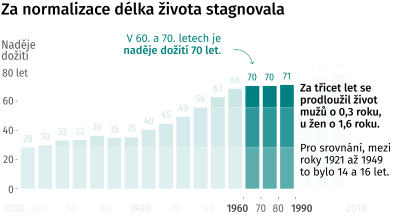
    

      Zdroj: Vladimír Srb: 1000 let obyvatelstva českých zemí, <a href="https://www.czso.cz/csu/czso/demograficka-prirucka">Demografická příručka ČSÚ</a>
    

  </figure>
</wide>

Optikou příčin úmrtí se 20. století dělí na období do roku 1948 a období po něm. V tomto roce, na švu mezi pátou a šestou revizí, proběhl radikální řez: výrazně se proměnilo uspořádání diagnóz do skupin, změnila se také logika sledování vnějších příčin úmrtí – kromě otázky, _jak_ k němu došlo, přibyl anatomický pohled, _jaká část těla_ byla poraněna. Fakt, že zároveň s touto revolucí rozdělil 20. století také komunistický puč, je sympatická náhoda; umožňuje odděleně sledovat vývoj úmrtnosti ve starém a novém politickém režimu.

Hlavní změna – tedy z pohledu statistiky – se ale týká otázky, co považovat za skutečnou příčinu úmrtí.

Úmrtí obvykle nepřichází ze dne na den, je výsledkem vývoje, řetězce příčin. Na počátku takového řetězce může být relativně nevinný zdravotní problém, například _vysoký tlak_, na konci _srdeční infarkt_. Lékař, který pacienta ošetřoval a vyplňuje takzvaný _list o prohlídce zemřelého_, vyplní celý řetězec. Z něj pak statistik vybere jednu položku, kterou uvede jako příčinu úmrtí.

A právě způsob, jakým položku vybere, se v roce 1948 změnil. První revize MKN považovaly za rozhodující _bezprostřední příčinu úmrtí_, tedy poslední údaj v řetězci. Šestá revize, která vstoupila v platnost právě roku 1948, to změnila: nyní byl za příčinu úmrtí považován začátek řetězce. Předtím by se v našem příkladu jako příčina úmrtí objevil srdeční infarkt, po něm vysoký tlak.

V Československu se nová pravidla začala uplatňovat po roce 1954 a projevila se zřejmě až postupně – v žádné skupině příčin se počty úmrtí nezměnily skokově.

Podobné změny se ale mohou objevit na každém švu mezi dvěma revizemi. Nejviditelnější je ta mezi sedmou a osmou revizí na přelomu let 1967 a 1968. Z roku na rok přibylo víc než dvacet tisíc obětí oběhových nemocí, naopak u nemocí nervové soustavy spadla úmrtnost téměř na nulu. Nejde o zamlčený důsledek sovětské okupace – je to tím, že _mozkovou mrtvici_ nová klasifikace považuje za problém cév, nikoli nervů, jak tomu bylo dříve.

<wide>
  <figure id="graf-zlom" class="priciny-umrti-vis-static">
    <!-- TODO: alt texty -->
    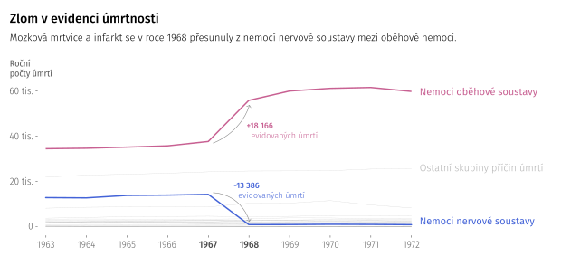
    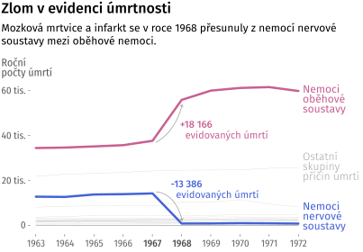
    

      Zdroj: <a href="https://www.czso.cz/csu/czso/zemreli-podle-podrobneho-seznamu-pricin-smrti-pohlavi-a-veku-v-cr-1919-2005-a95l7hehjg">Zemřelí podle podrobného seznamu příčin smrti, pohlaví a věku, ČSÚ</a>
    

  </figure>
</wide>

Ještě jeden faktor hraje při výkladu dat podstatnou roli: podíl _nepřesně určených příčin úmrtí_. Ukazují to data z prvních let po vzniku Československa, kdy byla nejčastější příčinou úmrtí _stařecká sešlost_. V roce 1919 jí statistika připisuje 28 tisíc, tedy asi 16 procent všech úmrtí.

Pohledem současné medicíny jde o chybný údaj – lékaři by měli být schopni určit příčinu přesněji. Podobných diagnóz je přitom v klasifikacích více. Sdružují se ve zvláštní skupině diagnóz, které se nevešly jinam, pojmenované nejprve nemoci _špatně definované_, dnes _příznaky, znaky a abnormální klinické a laboratorní nálezy nezařazené jinde_.

„Statistika, v níž 20 až 25 procent příčin připadá na tuto třídu, se považuje za nekvalitní,“ upozorňuje Srb.

Československá statistika úmrtí jako celek je na tom v tomto ohledu slušně – podíl nepřesných příčin brzy spadl pod deset procent a už tam zůstal.

<wide>
  <figure id="graf-nepresne-urcene-priciny" class="priciny-umrti-vis-static">
    <!-- TODO: alt texty -->
    
    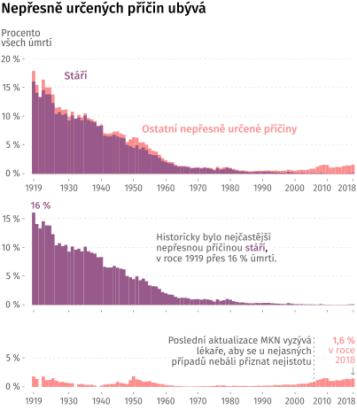
    

      Zdroj: <a href="https://www.czso.cz/csu/czso/zemreli-podle-podrobneho-seznamu-pricin-smrti-pohlavi-a-veku-v-cr-1919-2005-a95l7hehjg">Zemřelí podle podrobného seznamu příčin smrti, pohlaví a věku, ČSÚ</a>
    

  </figure>
</wide>

V některých částech země se ale dařilo méně. Zatímco v české části federace bylo v padesátých letech nepřesně určených úmrtí kolem pěti procent, na Slovensku čtyřikrát tolik. Jednou z příčin byla existence takzvaných laických ohledačů: ti s určením příčiny úmrtí zastoupili lékaře, pokud se nemohl dostavit. Na Slovensku přitom třetinu úmrtí ještě v padesátých letech stanovili právě laici.

Laičtí ohledači měli tendenci přiklánět se k diagnózám, které byly „zřejmé“ – pokud neznali anamnézu zemřelého, většinou uvedli _stáří, selhání srdce_ nebo podobně nekonfliktní příčinu úmrtí.

Kritický pohled na příčiny úmrtí ale připomíná, že problém se neomezuje jen na laiky.

„Jediný způsob, jak si být _téměř_ jistý příčinou smrti, je pitva,“ [vysvětloval autorům článku](https://ihned.cz/c1-61452430-delka-zdraveho-zivota-u-nas-klesa-prodluzujeme-stonani-je-to-ekonomicka-past-varuje-lekar) před lety Jan Holčík, dlouholetý profesor sociálního lékařství na Masarykově univerzitě. „Kdybych to odhadl – a možná je můj odhad naprosto nesprávný – tak se pitvá 10 až 20 procent lidí, u všech ostatních se příčina úmrtí odhaduje na základě dřívější diagnózy.“

[Data ÚZIS o počtu pitvaných pacientů](https://www.uzis.cz/res/f/008297/nzis-rep-2019-k24-a054-patologie-2018.pdf) Holčíkův odhad potvrzují, ukazují nicméně na rychlý propad v posledních letech. Mezi roky 2007 a 2018 se podíl pitvaných snížil z 18 na méně než 6 procent.

„V mezinárodním srovnání máme sice propitvanost jednu z největších na světě, ale nezbývá než připustit, že příčina smrti u nepitvaných pacientů, tedy u zbývajících 80 procent, je nejistá,“ pokračuje.

„Chybná data nejsou jediný problém,“ dodává Holčík. „Další nastanou při interpretaci. Je tu třeba paradox lepší diagnostiky. Když jsou onkologové tak šikovní, že si pomocí screeningu zavčasu stáhnou všechny pacienty, bude ve statistikách vyšší nemocnost a někdy i úmrtnost na nádory. Prostě proto, že se o nich ví.“

Je ale třeba dodat, že ani kritici, kteří příčiny úmrtí označují za měkká data – jako je profesor Holčík – nic nenamítají proti hlavním obrysům, které z dat vystupují. V době vlády jedné strany je to stagnace délky života a dominance civilizačních nemocí spojených s hrůzostrašným životním stylem.

<wide>
  

    

      <h3>Od šedesátých let úmrtnost stagnovala</h3>
      

        Podobně jako po první, i po druhé světové válce se úmrtnost snižovala: mezi lety 1949 a 1959 klesla standardizovaná míra úmrtnosti z 1584 na 1294 úmrtí na 100 tisíc obyvatel. Jenže od té doby se téměř nezměnila, za dalších třicet let klesla jen minimálně z 1294 na 1233 úmrtí.
      

    

    

      <h3>Normalizační životní styl</h3>
      

        Se stárnoucí populací mezi příčinami úmrtí přibývalo nemocí srdce a cév. Maxima tahle linka dosáhla v osmdesátých letech, kdy právě sem spadalo víc než 55 procent všech úmrtí. Může za to hlavně životní styl, který za normalizace zvítězil: pivo, bůček a cigarety.
      

    

    

      <h3>Komunistický teror</h3>
      

        Konec čtyřicátých a začátek padesátých let se do dat propsal nárůstem obětí poprav, a také nehod, do kterých se zřejmě skryla řada násilných úmrtí. Nárůst se ale podle oficiálních čísel vyhnul sebevražednosti. Až do roku 1967 čeští statistici pracovali s příčinou úmrtí <em>Úraz v dole nebo lomu</em>, ačkoliv jiné země ji dávno vyřadily.
      

    

    

      <h3>Nejvíc sebevražd: 1970</h3>
      

        Statistiky sebevražednosti se v celém období, alespoň oficiálně, pohybovaly pod čísly první republiky. Maxima dosáhly na konci šedesátých let, snad i v souvislosti s vpádem vojsk Varšavské dohody. Později, během normalizace, už číslo vytrvale klesalo.
      

    

    

      <h3>Eradikace nakažlivých nemocí</h3>
      

        Díky antibiotikům a později také očkování se podařilo vymýtit dětskou tuberkulózu, radikálně snížit počty obětí tuberkulózy ve vyšším věku, spály, záškrtu, spalniček i dávivého kašle. V roce 1949 na infekce zemřelo víc než 10 tisíc lidí, o čtyřicet let později měly jen čtyři stovky obětí.
      

    

    

      <h3>Srážka s tankem?</h3>
      

        Linka obětí dopravních nehod má možná překvapivý vývoj: nejprve jich přibývá, v letech 1968 a 1969 přijde maximum, pak se trend zlomí a mrtvých je méně. Vedle bezpečnějších aut může trend vysvětlovat také jejich nedostupnost v posledním desetiletí vyčerpaného režimu. Ale jen částečně: víc než obětí za volantem bylo mrtvých chodců.
      

    

    

      <h3>Radikální propad novorozenecké úmrtnosti</h3>
      

        V devatenáctém století tvořili třetinu mezi všemi úmrtími v českých zemích kojenci. V padesátých letech to byla desetina, v roce sametové revoluce jen půl procenta. Ruku v ruce s tímto se rychle snižovala i mateřská úmrtnost.
      

    

    

      <h3>Najděte další příběhy sami</h3>
      

        Nyní jsou data opět jen vaše.
      

    

    

      <svg class="priciny-umrti-pribehy-viz komunismus-pribehy-viz"></svg>
    

  

</wide>

<wide>
  

    
    
    
    
    
    
  

</wide>

<h2 class="priciny-umrti-nadpis-kapitoly">Stín po železné oponě</h2>
<h2 class="priciny-umrti-podnadpis-kapitoly">1990 až 2018</h2>

Sametová revoluce ze dne na den změnila politický režim. Proměnit tak setrvačný obor jako zdravotnictví je ovšem záležitost na desítky let. Zvlášť ukazatele jako délka dožití se mění zvolna, jelikož starší generace se většinou drží svých životních návyků a zlozvyků, k nim se přidává zdravotní zátěž z minulých let.

„V medicíně je asi taková setrvačnost, jako když obracíte námořní loď,“ [podotkl v rozhovoru](https://www.irozhlas.cz/zivotni-styl/zdravi/psychiatr-uzkost-deprese-antidepresiva-spotreba-leciv-martin-anders_1811080630_jab) Martin Anders, jeden z architektů reformy psychiatrické péče.

Pivo a párek ostatně stále patří k obrazu spokojeného Čecha a <a href="https://www.vlada.cz/cz/ppov/protidrogova-politika/media/vyrocni-zprava-o-drogach-mira-uzivani-alkoholu--tabaku-nebo-konopnych-latek-zustava-v-cr-vysoka--situace-se-lepsi-u-dospivajicich-184879/" target="_blank">spotřeba alkoholu ani cigaret neklesá</a>. Dobrá zpráva je, že mladší generace pije i kouří méně. Špatná, že oba zlozvyky se tím pádem koncentrují mezi méně staršími lidmi a přibývá rizikových pijáků.

„I v polovině 90. let zaostává Česká republika za ostatními vyspělými zeměmi Evropy _(v naději dožití, pozn. red.)_ zhruba o sedm až deset kalendářních let,“ píše v publikaci _Tisíc let obyvatelstva českých zemí_ demograf Vladimír Srb.

<wide>
  <figure id="graf-nadeje-doziti-soucasnost" class="priciny-umrti-vis-static">
    <!-- TODO: alt texty -->
    
    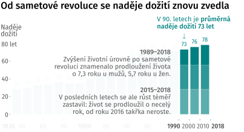
    

      Zdroj: <a href="https://www.youtube.com/watch?v=dQw4w9WgXcQ">Demografická příručka ČSÚ</a>
    

  </figure>
</wide>

Do devadesátých let Češi naňahňali <a href="https://cs.wikipedia.org/wiki/Druh%C3%BD_demografick%C3%BD_p%C5%99echod" target="_blank">hodnotovou revoluci</a>, která na Západě probíhá od let šedesátých.  V zemi tak během několika roků po pádu režimu stoupl věk, kdy žena povine první dítě, o pět let; první svatba se posunula o sedm let. Polovina manželství v té době končila rozvodem. Poměr dětí a seniorů se v tomto období [změnil ve prospěch seniorů](https://www.irozhlas.cz/zpravy-domov/-v-roce-1989-bylo-v-cesku-deti-skoro-dvakrat-vic-nez-senioru-pomer-se-otaci_201411100044_vkourimsky). Rychlost i rozsah změn ukazujeme v [interaktivní kalkulačce](https://www.irozhlas.cz/zpravy-domov/kalkulacka-spocitejte-si-kdy-vas-ceka-svatba-dite-rozvod-nebo-umrti_1704241238_sam).

Radikální experiment s hledáním štěstí <em>teď hned</em> se vyčerpal během nultých let, od té doby se demografické ukazatele ustálily na nové hladině.

S nástupem individualismu se zvýšila také životní úroveň a s ní délka života. Po šedivých normalizačních letech se tak život Čechů začal znovu prodlužovat. Jazykem sociální medicíny začala tranzice z <em>období degenerativních a člověkem způsobených nemocí</em> do <a href="https://www.ncbi.nlm.nih.gov/pmc/articles/PMC5429583/" target="_blank"><em>věku opožděných degenerativních onemocnění</em></a>.

Přesto je i dnes v datech o délce dožití patrné, <a href="https://interaktivni.rozhlas.cz/umrti-srdce/" target="_blank">kudy vedla železná opona</a> mezi Západem a Východem. Třicet let po pádu Berlínské zdi se rozdíl v délce dožití sice snížil na tři až pět let, ale úplnému vymazání vytrvale odolává.

<wide>
  <figure id="graf-zelezna-opona" class="priciny-umrti-vis-static">
    <!-- TODO: alt texty -->
    
    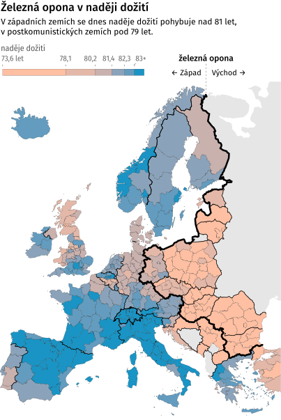
    

      Zdroj: <a href="https://ec.europa.eu/eurostat/databrowser/view/tgs00101/default/table?lang=en">Life expectancy at birth by sex and NUTS 2 region, Eurostat</a>
    

  </figure>
</wide>

V čem jsou dnes hlavní rozdíly mezi zeměmi na západ a na východ od železné opony? Ve kterých příčinách úmrtí zaostáváme? Můžeme se poučit, jak se s nimi před léty vypořádaly země, které se v epidemiologických ukazatelích pokoušíme dohnat?

Od sametové revoluce se střední délka života na obou stranách opony přiblížila. V Česku je klíčový trend snižování úmrtnosti na nejčastější příčiny úmrtí – nemoci oběhové soustavy a novotvary. V jejich stínu se ale nečekaně vrací minulá rizika.

„Zatímco ‚staré‘ infekce jsou na prahu vyhubení, objevují se nové,“ [upozorňuje](https://owncloud.cesnet.cz/index.php/s/m8ngF4L6LB2L4wJ) demografka Markéta Pechholdová z katedry demografie Vysoké školy ekonomické. Jde například o bakterie rezistentní vůči antibiotikům nebo nemoci přenesené ze zvířat. Upozorňuje také na návrat nemocí, proti kterým je vakcína dostupná – spalniček, dětské obrny, záškrtu a černého kašle.

S novými infekcemi jsou spojena nová rizika. Problémy nemocí přenesených ze zvířat není potřeba představovat – zatímco epidemii netopýřího viru SARS v roce 2002 se ještě podařilo zastavit včas, prasečí chřipka v roce 2009 stála po celé planetě půl milionu životů, aktuální pandemie dosud téměř čtyřikrát tolik. Podobně nebezpečná je podle epidemiologů také rezistence bakterií na antibiotika: podle WHO jde o [jedno z nejpodceňovanějších zdravotních rizik](https://www.who.int/news-room/fact-sheets/detail/antimicrobial-resistance).

Oproti klasickým civilizačním nemocem navíc nákazy často zabíjejí v nižším věku, některé výrazně – například AIDS. Pokud bychom se tedy ptali, o kolik roků nemoc zkrátila život, infekční nemoci budou hrát větší roli než aktuální dvě procenta v celkové úmrtnosti.

Přes nové problémy je vývoj naděje dožití i úmrtnosti od sametové revoluce optimistický.

<wide>
  

    

      <h3>Devadesátkový optimismus</h3>
      

        Sametová revoluce po desetiletích stagnace vrátila pozitivní vývoj. Naděje na lepší zítřky i rychle rostoucí životní úroveň devadesátých let pomohly snížit standardizovanou míru úmrtnosti z 1102 úmrtí na 100 tisíc obyvatel v roce 1990 na 807 v roce 2000. Až v posledních letech trend zpomalil.
      

    

    

      <h3>Zlom v nemocech srdce</h3>
      

        Nejdůležitější lékařská zpráva posledních třiceti let zní: ubylo obětí nemocí srdce a cév. Ze 72 tisíc v roce 1990 na současných 48 tisíc obětí, neboli z 56 procent všech úmrtí na 43 procent. Změnil se životní styl, mohutně se rozšířily možnosti akutní medicíny i spektrum léků pro kardiaky.
      

    

    

      <h3>Delší život, vyšší podíl rakoviny</h3>
      

        Rakovina patří k nemocem, které obvykle nastupují ve vyšším věku. S rostoucí nadějí dožití se proto také zvyšuje podíl rakoviny na všech úmrtích. Dnes má na svědomí asi 25 procent všech úmrtí, u mužů o procento více, u žen méně. Nejvíc obětí mezi nádory má dlouhodobě rakovina průdušky a plíce.
      

    

    

      <h3>Diabetes v datech</h3>
      

        V roce 2013 náhle o třetinu vyletěl počet obětí nemocí žláz a výživy. Na vyšší hladině už zůstal. Není to tím, že by Čechy překvapil hlad; jde o důsledek subtilní změny na listu o prohlídce zemřelého. Doplnění jednoho řádku do řetězce příčin úmrtí nečekaně výrazně zvýšilo podíl diabetiků ve statistice.
      

    

    

      <h3>Sepse a rezistentní bakterie</h3>
      

        Od začátku 21. století opět roste zastoupení infekčních nemocí. Stále jde o minoritní příčiny, celá kapitola může za cca dvě procenta úmrtí. Za nárůstem stojí hlavně diagnóza <em>jiná sepse</em>: bakteriální infekce, která se typicky objeví po operaci. Do budoucna jsou rizikem bakterie rezistentní vůči antibiotikům.
      

    

    

      <h3>Ekonomická krize a sebevraždy</h3>
      

        Od šedesátých let pokračuje trend snižování počtu sebevražd. Výjimkou je období po globální ekonomické krizi – v letech 2009 až 2013 se statistika sebevražednosti načas zhoršila, podobně jako ve třicátých letech minulého století. Přesto dnes vlastní rukou zemře dvojnásobek lidí, než kolik jich zemře na silnicích.
      

    

    

      <h3>Favorit → Fabia</h3>
      

        U dopravních nehod přinesl začátek devadesátých let nárůst počtu obětí – až do roku 1994, kdy chatrnou Škodu Favorit začala nahrazovat bezpečnější Fabia. Podle dopravních expertů je skutečně mezi poklesem úmrtnosti na silnicích a novým modelem škodovky souvislost.
      

    

    

      <h3>Najděte další příběhy sami</h3>
      

        Možná jsou vám tato data bližší než data z minulých období. Ponořte se do nich.
      

    

    

      <svg class="priciny-umrti-pribehy-viz soucasnost-pribehy-viz"></svg>
    

  

</wide>

<wide>
  

    
    
    
    
    
    
  

</wide>

<h2 class="priciny-umrti-nadpis-kapitoly">Do střev</h2>
<h2 class="priciny-umrti-podnadpis-kapitoly">2020 a dál</h2>

Poslední krok k pochopení úvodní otázky – co znamená _na covid_ a co _s covidem_ – je pohled pod ruce těch, kteří příčiny úmrtí zapisují dnes.

Představa, kde hledat skutečnou příčinu úmrtí, je dnes stejná jako v roce 1948, kdy začala platit šestá revize MKN: u přirozených příčin je to _choroba nebo trauma, které inicializovaly řetězec chorobných stavů přímo vedoucích k smrti_, u náhlých úmrtí _okolnosti nehody nebo násilí, které přivodily smrtelné zranění_.

Postupy, jak ji hledat, se ale neustále mění. Na jednu stranu dnes většina zemí na planetě využívá _MKN-10_, která je k dispozici přes 25 let; to je nejdelší období se stejnými pravidly. Jenže od roku 1994, kdy vstoupila v platnost, je minimálně stejně důležitý způsob, _jak_ lékař a po něm statistci příčinu smrti vybírají. Přestože je lidský faktor při rozhodování nezbytný, některá rozhodnutí usnadňuje a zpřesňuje strojové zpracování. Na výsledné statistice se projeví velmi výrazně – v letech, kdy se nástroje zaváděly, se v časových řadách u některých diagnóz objevují výrazné zlomy.

První krok při určování příčiny úmrtí má na starosti ohledávající lékař, který vyplní _list o prohlídce zemřelého_. K [necelým dvěma třetinám úmrtí dochází v nemocicích](https://www.uzis.cz/res/f/008309/demozem2018.pdf), kde má lékař k dispozici detailní anamnézu mrtvého. Pokud si příčinou není jistý, může nařídit pitvu. V některých situacích to přímo nařizuje [zákon o zdravotních službách](https://www.zakonyprolidi.cz/cs/2011-372#cast7).

„V zásadě by ohledávající lékař měl vyslovit návrh k pitvě vždy při pochybnosti o příčině smrti u osob zemřelých náhle, u osob žijících osaměle, zemřelých mimo zdravotnická zařízení a v případě, že je nucen uvést diagnózu _příčina smrti neznámá_,“ popisuje manuál pro lékaře.

<figure>
  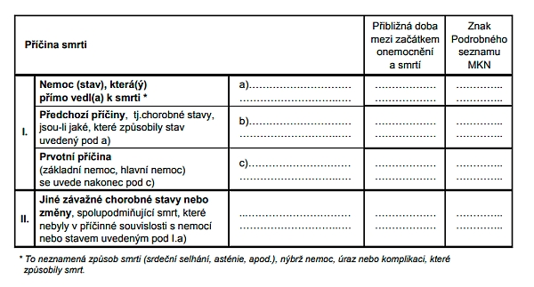
  <figcaption>Současná verze listu o prohlídce zemřelého</figcaption>
</figure>

Lékařská část _listu o prohlídce zemřelého_ má dva oddíly, klíčový je první: v jeho nejvyšším řádku lékař uvede _bezprostřední příčinu smrti_, tedy stav, který úmrtí přímo způsobil. Od něj se postupně odvíjí řetězec zdravotních příčin, které ke kritickému stavu vedly; až k nemoci nebo zranění, které vše vyvolaly. Ty se označí za _základní příčinu smrti_. U každého stavu pak lékař doplní, jak dlouho před smrtí nastal.

V druhé části listu lékař doplní ještě zdravotní problémy zemřelého, které ale podle jeho názoru na fatální vyústění nemají vliv.

List pak putuje na dva úřady, které pečují o statistiku příčin úmrtí. Data vznikají na ČSÚ, ale metodiku hlídá ÚZIS. Ten také spravuje registr, kde se listy shromažďují, školí lékaře nebo hlídá, aby se česká metodika shodovala s obsáhlými pravidly WHO.

„Na rozdíl od lékařů už nemáme přístup ke zdravotní dokumentaci, proto jsme závislí na tom, jak kvalitně list o prohlídce zemřelého vyplní,“ vysvětluje Šárka Daňková z ÚZIS, která je garantkou zmíněných činností. „Nerada bych, aby to vyznělo špatně, ale právě chybně vyplněný list je častý problém.“

„Některé triviální příčiny, jako je například padání vlasů, by neměly vést ke smrti,“ připomíná [na webu, věnovanému demografii](http://www.demografie.info/?cz_detail_clanku&artclID=840) na nejbizarnější chyby.

<wide>
  <figure id="posloupnosti" class="priciny-umrti-vis-static">
    
    

      Zdroj: <a href="https://www.uzis.cz/sites/default/files/knihovna/lpm_pruvodce_2006.pdf">Jak správně postupovat při vyplňování Listu o prohlídce mrtvého, ÚZIS</a>
    

  </figure>
</wide>

Statistici s vyplněným listem o prohlídce zemřelého postupují opačně, zdola nahoru. Do dat o příčinách úmrtí obvykle uvedou stav, od kterého se podle lékaře začala posloupnost odvíjet, a označí jej za _základní příčinu smrti_.

Právě tady do procesu zasáhla automatizace asi nejvýrazněji: od roku 2011 mají statistici k ruce IRIS, algoritmus, který na listech o prohlídce zemřelého najde příčinu podle pravidel WHO automaticky. Jejich principy naznačuje zjednodušený [manuál pro lékaře](https://www.uzis.cz/sites/default/files/knihovna/lpm_pruvodce_2006.pdf), ale [plné znění](https://www.uzis.cz/res/f/008277/mkn-10-instrukcni-prirucka-20200101.pdf) je příliš složité, aby je nosily v hlavě lidské bytosti. Asi devadesát procent případů, které IRIS projde, je bezproblémových.

Jenže ne všechny. Se zbylými deseti procenty, tedy asi deseti tisíci listů ročně, si algoritmus kvůli chybám neví rady. U nich statistici hledají příčinu manuálně: při hledání správného řetězce pomáhají IRIS najít někde na listu uvedenou příčinu, například si ji „vypůjčit“ z druhé části listu o prohlídce zemřelého.

„Někdy se ozveme lékaři, který list vyplňoval. Ale to jen ve vzácných případech, kdy je jako příčina úmrtí uvedená cholera, vypadané vlasy nebo podobná diagnóza,“ popisuje Daňková.

Když riskneme rychlý pohled do střev algoritmu, narazíme na signifikantní záhyb – tabulky, které určují, jak na sebe diagnózy mohou navazovat. Je _pád ze žebříku_ a následná _zlomenina stehenní kosti_ platná posloupnost? Pravděpodobně ano. Zatímco _pád ze žebříku_ a následný _pásový opar_ není.

To je důležité i pro statistiku covidových úmrtí. U něj pravidlo říká, že nemůže být následkem žádné jiné nemoci. Pokud se tedy objeví v řetězci, který vedl ke smrti, je pro statistiky příčinou úmrtí právě covid.

Zmíněné tabulky povolených příčin a následků se v Česku využívají od roku 2007, předtím statistici řetězce kódovali ručně. Celý IRIS běží od roku 2011. Právě v těchto letech se u některých příčin časová řada láme.

„Z vývoje úmrtnosti na některé příčiny je zřejmé, že dochází ke zpřesnění a zkvalitnění statistiky,“ vysvětluje Daňková. „Lze to dokumentovat klesajícím podílem zemřelých na aterosklerózu _(kornatění tepen, pozn. red.)_, která není doporučena ke kódování základní příčiny smrti vzhledem k tomu, že se jedná o velice generalizované, málo specifické onemocnění.“

„Významné změny se týkají také dalších příčin, jako jsou hypertenze, infarkt myokardu, cévní mozková příhoda, pneumonie a diabetes,“ dodává.

Na nečekaně masivní změně některých diagnóz, třeba právě diabetu, se podepsal také nenápadný detail: v roce 2012 na první část listu o prohlídce zemřelého statistici přidali čtvrtý řádek.

<wide>
  <figure id="graf-ateroskleroza" class="priciny-umrti-vis-static">
    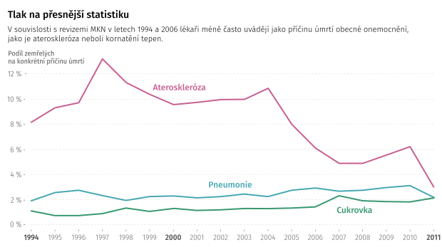
    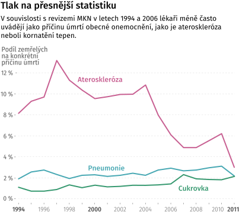
    

      Zdroj: <a href="http://www.demografie.info/?cz_detail_clanku&artclID=840">Demografie.info</a>
    

  </figure>
</wide>

Algoritmické určování příčin úmrtí má z pohledu statistiky zásadní výhodu: odstraňuje nahodilost. To je také hlavní důvod, proč Eurostat tlačí národní statistické úřady k využívání podobných nástrojů. Konzistentní kódování umožňuje lepší srovnání úmrtnosti mezi zeměmi. Taková srovnání byla v minulosti poměrně nespolehlivá, dnes je i díky podobným nástrojům nesrovnatelně vyšší.

Integraci nástrojů má završit dlouho očekávaná jedenáctá revize MKN, která má v Evropě začít platit za rok. Hlavní novinkou mají být právě [jednotné online nástroje](https://www.who.int/classifications/classification-of-diseases).

„Ona sice začne platit, ale reálně se pravděpodobně jestě pár let používat nebude,“ upozorňuje Daňková. „Aktuálně pracujeme na překladu, což chvíli potrvá. Pak se musí připravit systémy poskytovatelů zdravotní péče. Jsou země, které už na novou revizi přechází, jako Malta nebo Rwanda, ale WHO ještě pět let umožní posílat data v MKN-10.“

<h3>Mezinárodní srovnání</h3>

Ve Francii měl covid během jarní vlny 31 tisíc obětí. Ve Španělsku byl oficiální počet úmrtí na covid podobný, 34 tisíc, jenže celková úmrtnost se proti dlouhodobému průměru zvedla o 56 tisíc lidí.

Francie a Španělsko nejsou jediní: <a href="https://www.economist.com/graphic-detail/2020/07/15/tracking-covid-19-excess-deaths-across-countries">výsledná čísla se podstatně liší</a> v celé Evropě. Počet obětí covidu se s nárůstem úmrtnosti <a href="https://www.irozhlas.cz/zpravy-domov/celkova-umrti-listopad_2012070635_pek">rozchází také v Česku.</a>

Důvod, proč statistici doporučují pro sledování dopadů pandemie sledovat spíše druhé číslo – nárůst celkové úmrtnosti – je právě časově náročné určování příčin úmrtí, popsané v textu.

Stejnými neduhy trpí také srovnání úmrtnosti na jiné příčiny. Všechny evropské země využívají stejnou revizi MKN, tedy stejné diagnózy a podobná pravidla pro určení hlavní příčiny úmrtí. Jenže výsledná statistika ukazuje výrazné rozdíly.

„Ve Francii se podle statistik víc umírá na žaludek, v Německu na srdce,“ vypráví bývalý profesor sociálního lékařství Jan Holčík. „Není přitom moc jasné, proč. Nemusí jít vůbec o objektivní důvody, spíš o to, co jsou lékaři zvyklí uvádět jako hlavní příčinu.“

Lepší mezinárodní srovnatelnost je jeden z cílů zpřesnění příčin úmrtí.

„Nyní již máte dostatek informací, abyste mohli vydedukovat, jak to bylo doopravdy,“ zněla ikonická věta ve špatném, ale legendárním detektivním seriálu Hříchy pro pátera Knoxe z devadesátých let.

Nyní již máte dostatek informací, abyste uměli přečíst, na co Češi umírali od založení republiky do dneška. Časová řada je standardizovaná podle současné české populace – ukazuje tedy, jak by vypadaly příčiny úmrtí, kdyby byla v každém roce stejná věková struktura, jako je ta dnešní.

<wide>
  

    

    

    

      <svg class="priciny-umrti-pribehy-viz stoleti-explorace-viz"></svg>
    

  

</wide>

<h2 class="priciny-umrti-nadpis-posledni-kapitoly">Covidová poprvé</h2>

„Značná část zemřelých vykazovala řadu komorbidit, která průběh nemoci komplikovala,“ vysvětloval ministr zdravotnictví Jan Blatný v tiskové konferenci, kterou jsme článek otevírali. Na stejném místě ho i uzavřeme.

„U této skupiny je vyhodnocení základních příčin smrti velmi obtížné, a proto budou záznamy podrobeny další analýze klinickým expertním týmem a bude provedena kontrola zdravotnické dokumentace,“ řekl Blatný.

Patnáctičlenná komise odborníků pro posouzení příčin úmrtí bude v českých dějinách unikát.

„Vůbec poprvé v se zabýváme úmrtností na některou konkrétní příčinu tak podrobně,“ vysvětluje Šárka Daňková z ÚZIS. „Dříve probíhaly validace, například propojením dvou datových zdrojů, či kontroly listu o prohlídce zemřelého u jednotlivých úmrtí, nikdy však v takovém rozsahu jako nyní.“

„Jedním z důvodů je mediální tlak,“ dodává. „Jsme neustále oslovováni, abychom rozlišili úmrtí _na covid_ od úmrtí _s covidem_. Přitom to vůbec není tak snadné, jak se může zdát.“

Problematických míst je podle ní několik.

„Pokyny pro vykazování úmrtí za covid uveřejnilo WHO až v dubnu 2020, lékaři proto neměli přesné instrukce a postupovali různě,“ pokračuje. „Kromě toho se vyvíjí také onemocnění jako takové a jeho poznání. V prosinci 2020 WHO zavedlo další kódy pro stavy následující po onemocnění covid-19. Pravidla se tak lékařům mění pod rukama.“

„Snažili jsme se reagovat, ne vždy se však požadovaná informace k lékařům dostala včas. Sledovali jsem, co se v praxi děje, procházeli jsme listy o prohlídce zemřelého a snažili se jeden po druhém vyhodnotit. Bohužel, reálné listy nevypadají jako modelové příklady.“

Detailní zkoumání covidových úmrtí vyústilo ve studii, jaké další zdravotní problémy se u zemřelých na covid objevují nejčastěji – té, kterou ministr cituje na tiskové konferenci.

Ministerská komise slibuje detailní data o covidových úmrtích, ale až s časovým odstupem. Ministr upozorňuje, že shromáždit stoprocentní data k příčinám úmrtí potrvá měsíce. Slibuje sice, že část bude k dispozici na konci února, finální data ale zřejmě mnohem později.

A tak nejlepší evidence, kterou k počtu obětí covidu aktuálně máme, je _nadúmrtnost_, tedy počet zemřelých nad dlouhodobým průměrem. I tato data mají proti skutečnému stavu zpoždění, ale jen několikatýdenní. Srovnání oficiálních a poměrně nepřesných covidových úmrtí a dat o nadúmrtnosti ukazují na rozdíl: covidových obětí bylo od ledna do listopadu XXX, nadúmrtnost XXX lidí.

<wide>
  <figure id="graf-excess-mortality" class="priciny-umrti-vis-static">
    <!-- TODO: presunout do naseho repa -->
    
    
  </figure>
</wide>

Rozdíl můžou být ukryté oběti covidu, ale z větší části jde zřejmě o úmrtí spojená s vyšší sebevražedností, dopady osamocení v sociálních zařízeních, s tím, že se lékaři nemohli naplno věnovat pacientům s jinými diagnózami, a podobně.

Není podstatné, zda budou úmrtí ve výsledku vyhodnocena jako _s covidem_ a _na covid_. Důležité je, že k nim dochází, nadúmrtnost to potvrzuje. Přesnější rozdělení příčin je totiž zatíženo tolika možnými chybami, že nedává příliš smysl.

Problematická je už základní úvaha, že umíráme na jednu příčinu. Reálně většinou umíráme na řetězec příčin, které se nabalují delší část života, jak naznačuje i podoba listu o prohlídce zemřelého.

Zajímavý krok stranou nabízí další demografka, Markéta Pechholdová z Vysoké školy ekonomické. Ta upozorňuje na příkladě takzvaných _septikémií_, že pravidla pro stanovení jedné příčiny úmrtí vytvářejí „neviditelné“ diagnózy. Septikémie jsou bakteriální infekce, typické pro stav po operaci. Obvykle doprovázejí jinou nemoc, která má v pravidlech vyšší prioritu, nicméně život mohou podstatně zkrátit – mezi příčinami úmrtí se proto objevují vzácněji, než by měly.

Způsobem, jak podobné diagnózy zviditelnit, je podle ní právě změna uvažování nad tím, _co_ je příčina úmrtí. Přirozenější je podle ní uvažovat o více příčinách, které působí společně. Statistici znají koncept pod názvem _sdružené příčiny úmrtí_.

Mimochodem, nejde o novinku.

„Také u nás jsme třídili a v letech 1925 až 1937 publikovali tabulky s kombinovanými příčinami smrti,“ píše demograf Vladimír Srb. „Avšak později pro nákladnost třídění a poměrně malé využití dat bylo od třídění upuštěno.“

Podle Daňkové je ovšem i tady klíčové mít přesná data – a to se ani po sto letech od vzniku systému neděje.

Nápad rehabilitovat sdružené příčiny úmrtí by nicméně mohl být elegantní odpovědí na otázku, zda _na covid_, nebo _s covidem_. Obojí.

_Za spolupráci děkujeme demografkám Šárce Daňkové z ÚZIS, Kláře Hulíkové Tesárkové z Katedry demografie a geodemografie Přírodovědecké fakulty UK a Markétě Pechholdové z Katedry demografie VŠE._
