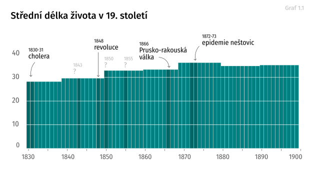
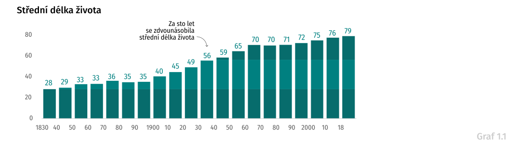
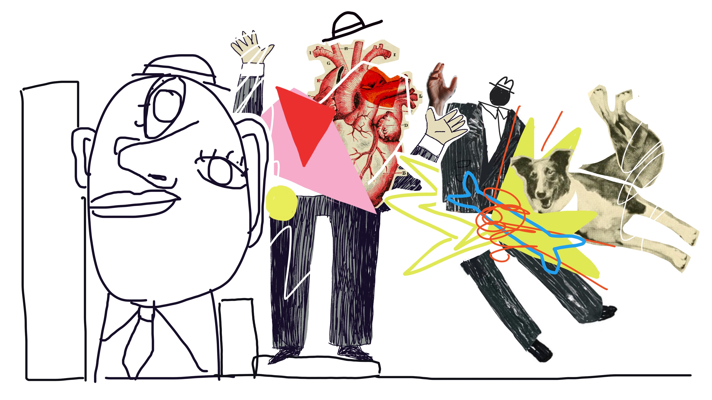

title: "Od moru ke covidu"
perex: "S covidem, nebo na covid? Na otázku, která na jaře zamotala hlavu celé civilizaci – tedy jaká je příčina úmrtí – hledá medicína odpověď přes sto let. Odpověď přitom rozhoduje o tom, čemu zdravotnictví věnuje pozornost a kam tečou peníze."
coverimg: assets/0_uvodni_ilustrace.jpg
coverimg_note: ""
styles: [https://fonts.googleapis.com/css2?family=Asap]
libraries: [] #jquery, d3, highcharts, datatables
options: [] #wide, noheader (, nopic)
---

Představte si situaci: pacient, který se celoživotně léčí s cukrovkou a bere léky na vysoký krevní tlak, zemře na komplikace spojené s novým koronavirem. Jaká je hlavní příčina smrti? Diabetes, hypertenze, nebo covid-19?

Pod svícnem pandemie se zdá jasné, že koronavirus. Jenže bez souběžných zdravotních problémů – komorbidit – nemoc obvykle nezabíjí. „Příčina úmrtí: covid-19“ je neúplná informace, která skrývá, že jde o pacienta s dlouhodobými potížemi.

Opačný případ, kdy lékař upřednostní některou z dlouhodobých příčin, zase povede k tomu, že pacient bude chybět mezi oběťmi covidu. Přitom je evidentní, že virus mu život zkrátil, často výrazně. Lékaři mluví o 10 až 20 letech.

Statistika příčin úmrtí, která má značný vliv na podobu dnešní lékařské péče, předpokládá, že příčina úmrtí je jen jedna. Pokud ale zdravotnická statistika systematicky upřednostní kterýkoliv ze zmíněných zdravotních problémů – což musí, nemají-li být data nahodilá – nutně přichází o část informace.

Nahraďte covid-19 ve zmíněném příkladu chřipkou a máte představu o dilematu, které zdravotnictví řeší přinejmenším posledních sto let. Odpověď má přitom přímý následek: společnost, která „dá přednost“ vysokému tlaku, najde v rozpočtu víc peněz pro léky na hypertenzi; tam, kde preferují chřipku, dostane přednost vakcína proti této nemoci.

Tady přibude graf / img

Komorbidita úmrtí na covid

Jaké onemocnění se často vyskytují současně při úmrtí na covid?

  
  
  
  
  
  
  

<h2>Kapitola 1: Umírání za císaře pána (1785-1918, protodemografie)</h2>

Důvod, proč začali panovníci hlídat, kolik a jak starých poddaných mají, byly války. Důvod, proč začali sledovat, na co umírají, epidemie.

V sedmnáctém století, kdy zakladatel epidemiologie John Graunt v Londýně krasopisně kreslil první úmrtnostní tabulky, byl ještě aktuální mor; na konci osmnáctého, kdy statistická novinka dorazila do rakouské říše, už morové rány odezněly. Místo něj teď křižovaly Evropu vlny pravých neštovic, cholery a záškrtu.

V českých zemích byli prvními demografy kněží, zmiňuje v knize Tisíc let obyvatelstva českých zemí pozoruhodný demograf Vladimír Srb. „Církevní výkazy o konskribovaných duších“ evidovaly v každé farnosti sňatky, narození a úmrtí od roku 1762. Čísla se nedochovala.

Světská moc následovala tu církevní se zpožděním dvou desítek let. Osvícenského císaře Josefa II. znají školáci díky tolerančnímu patentu a zrušení nevolnictví. Císař byl ovšem hlavně pragmatik a cílem josefinských reforem byla centralizace a racionalizace říše. Zavedl povinná psí vodítka a nenápadným patentem z února 1784 také úřední evidenci obyvatel.

První rakouská statistika úmrtí znala šest příčin smrti: nemoci obyčejné (gewöhnliche), místní (Ortskrankheit) a epidemické, sebevraždy, vraždy a úrazy. Pro sledování epidemií takové rozlišení stačilo.

„Pokud jde o epidemické nemoci, byl největší zájem věnován neštovicím a choleře,“ vrká Srb. „V roce 1808 vyšel dvorský dekret, který předpisoval lékařům hlášení hromadného výskytu úmrtí v obci na stejnou, ale kteroukoliv nemoc nadřízeným úřadům. Byla to jakási primitivní epidemiologická ohlašovací služba,“ vrká Protodušek.
 

Tady přibude fotka

Nejstarší dochované příčiny úmrtí (1828)

Neuvěřitelně působí fakt, že ještě před dvěma sty lety se naši předci dožívali v průměru stejného věku jako ve středověku – necelých třiceti let. Na základě kosterních nálezů odhadují historici střední délku života v osmém až desátém století na 27,6 roku. O tisíc let později to podle císařových dat bylo 28,2 roku.

Data z 18. století přitom napovídají, co životy zkracovalo: riskantní byl zejména kojenecký a dětský věk; charakteristické zuby v grafu pak odpovídají válečným rokům a vlnám epidemií.

<!-- 

Tady přibude graf
Střední délka života v 19. století
(1806, 1810, 1814: „Vysoká úmrtnost na začátku století byla jedním z důsledků napoleonských válek.“; 1831-3: cholera; 1843: ?; 1848: revoluce; 1850, 1855: ?; 1866: prusko-rakouská válka; 1872-3: epidemie neštovic; 1000 let, 08.jpg + 17.jpg)

 -->

Život se začal výrazněji prodlužovat až na konci století s rozvojem veřejného zdravotnictví. Experiment s dostupnou lékařskou péčí si mocnářství nejprve odbylo mimo mocenská centra – na Moravě. Zákon o veřejném zdravotnictví zde začal platit v roce 1884, hned v dalších letech je evidentní propad úmrtnosti – u infekčních nemocí na polovinu. Pro velký úspěch tak císař prosadil s několikaletým zpožděním stejné zákony i v Čechách a rakouském Tyrolsku a Vorarlbersku.

Když trochu předběhneme, během necelých 200 let se délka života protáhla z 28 na bezmála 80 let. Rozhodně ale nešlo o plynulou změnu: jsou období jako přelom 19. a 20. století, kdy se během jedné generace život prodloužil o 40 procent. V jiných dobách se nárůst délky života téměř zastavil, v některých desetiletích dokonce obrátil – například za reálného socialismu.

<!-- 

Tady přibude graf
změna střední délky života (abs., %) 1830 až 2019
třicetiletá období (1000 let, 17.jpg) 

 -->

Jedním z nejúspěšnějších období, co se týče prodloužení délky života, je přelom 19. a 20. století. Během jedné generace se – navzdory válce – život v českých zemích prodloužil o 40 procent.

Samotná válka si podle Srba vyžádala asi 300 tisíc přímých obětí, které ovšem v oficiální statistice chybí. Později historici jeho odhad například pomocí sčítání vdov <a href="https://www.dotyk.cz/publicistika/na-frontach-1-svetove-valky-padlo-kolem-200-tisic-cechu-odhaduje-statistik-20181113.html" target="_blank">upravili na 200 tisíc</a>. Srb ovšem vypočítává také nepřímé oběti: odhaduje, že kvůli válce nepřišlo na svět 910 tisíc dětí neboli 8,8 procenta předválečné populace.

Slabé válečné ročníky se mimochodem zařezávají do statistiky dodnes: důvod, proč jsou české školky několik let poloprázdné a vzápětí přeplněné, je právě rozkolísání porodnosti za první světové války. Podobný problém řeší většina evropských zemí; u některých se ještě prohloubil za druhé války, nejpalčivěji nenarozenou generaci <a href="https://www.irozhlas.cz/zpravy-svet/rusove-proti-rusum-zeme-v-nevyhlasene-obcanske-valce_1504291200_zlo" target="_blank">vnímá Rusko</a>.

  
  
  
  
  

<h2>Kapitola 2: První republika (1919-1948, války + Němci)</h2>

Po válce, zhoršené o pandemii španělské chřipky, se ovšem úmrtnost zásadně snížila. Ještě v roce 1919 zemřelo v západní části nově vzniklé republiky téměř 180 tisíc lidí; o čtyři roky později to bylo 142 tisíc. Úmrtnost se rychle snížila o pětinu a na této úrovni zůstala většinu první republiky.

Největší zlepšení v těchto letech zaznamenala úmrtnost na infekční nemoci a nemoci dýchací soustavy – obojí souvisí s válečnými roky a částečně zřejmě také se španělskou chřipkou. 

Víme to díky tomu, že Československo – v rámci loučení se se vším rakouským – spustilo revoluci také ve statistice. Místo málo podrobné c. k. statistiky úmrtí Čechoslováci adoptovali Mezinárodní klasifikaci nemocí (MKN). U ní se na chvíli zastavíme – dnes, o sto let později, je totiž základem zdravotnické statistiky celé planety.

MKN vznikla roku 1893 a po úspěchu ve Spojených státech se počátkem 20. století začala usazovat také v Evropě. Do té doby se systémy lišily nejen stát od státu, ale také město od města, takže statistika úmrtí často nebyla srovnatelná ani v rámci jedné země. MKN to chtěl změnit: jednotná klasifikace i pravidla umožňovala vnitrostátní i mezinárodní srovnání dat.

Autoři nového systému navíc počítali s tím, že zároveň s rozvojem medicíny se bude klasifikace rozšiřovat – navrhli proto upravit klasifikaci každých deset let. V roce 1919, kdy statistiku zavádělo Československo, byla platná druhá revize, označovaná MKN-2. 

Tady přibude ilustrace 2.0

MKN-2, případně MKN-10

Příčiny úmrtí jsou v klasifikaci sdružené do skupin podle typu, například <em>infekční nemoci</em> nebo <em>úrazy</em>. Zatímco konkrétní příčiny úmrtí – <em>tuberkulóza</em> nebo <em>uštknutí</em> – se mezi revizemi často mění, méně podrobné třídy příčin většinou zůstávají stabilní. Díky tomu můžeme s opatrností srovnávat čísla v čase.

  

    

      
      
Veselé diagnózy

      

        <em>Tady bude jeste kratky text k veselym diagnozam. Lorem ipsum dolor sit amet, consectetur adipiscing elit. Nam tempor metus eu rhoncus faucibus. Curabitur ut blandit nisi, vel rhoncus nisl. Maecenas finibus, tortor in volutpat feugiat, diam nisi tempus nibh, at semper lectus dui in massa.</em>
      

    

  

I struktura tříd příčin úmrtí se ale v minulosti jednou změnila. Shodou okolností opět zároveň s politickým režimem v Československu: v roce 1948. Nejprve proto ukážeme část statistiky pro období 1919 až 1948. 

K tomu zbývá vyřešit poslední problém: po roce 1938 přišlo Československo o pohraničí a s ním o část obyvatel. Ze statistik tak zmizely Sudety, s nástupem protektorátu pak i německé obyvatelstvo vnitrozemí. V počtech úmrtí je proto po roce 1938 schodek.

Tady přibude scrollytelling

Vysvětlení tří typů úmrtí (abs, rel, std)

Teď už je všechno připravené k tomu, abyste si prohlédli vývoj příčin úmrtí mezi vznikem Československa a vítězným únorem 1948.

<wide>
  

    

      <h3>Vývoj úmrtí 1919-1948</h3>
      

        Od konce první světové války do únorového převratu klesla úmrtnost o třetinu: z 2034 na 1324 úmrtí na 100 000 obyvatel.
      

    

    

      <h3>Od první republiky, přes 2. světovou válku</h3>
      

        <em>Kratky komentar k zobrazovanemu obdobi.</em>
      

    

    

      <h3>22 skupin příčin úmrtí</h3>
      

        Příčiny úmrtí se v tomto období seskupují do 16 skupin přirozených úmrtí: nemocí, vrozených vad, novorozenecké úmrtnosti i stáří. Vedle nich statistika ukazuje externí příčiny úmrtí jako vraždy, sebevraždy, dopravní nehody nebo náhodné úrazy.
      

    

    

      <h3>Stařecká sešlost</h3>
      

        V roce 1919 zemřelo s diagnózou <em>stařecká sešlost</em> 28 487 lidí, o třicet let později 5&nbsp;185 lidí. Neznamená to, že by v českých zemích ubylo sešlých starců – jen tolik, že během první republiky se zpřesnila statistika. Stáří jako příčinu úmrtí lékaři obvykle uváděli, pokud neznali přesný důvod.
      

    

    

      <h3>Posun v léčbě tuberkulózy</h3>
      

        V poválečných letech byly největší hrozbou infekční nemoci. Nejobávanější byla tuberkulóza – mezi infekcemi měla na svědomí 60 až 70 procent úmrtí a zabíjela v každém věku, včetně dětského. Během první republiky se podařilo úmrtnost na infekce díky lepší zdravotní péči a lepší výživě snížit na třetinu.
      

    

    

      <h3>Šiřící se obezita</h3>
      

        Okamžik, kdy nemoci srdce přebraly prvenství v úmrtnosti od infekčních nemocí, je pro medicínu důležitý. U tuberkulózy je ochranným faktorem obezita; u nemocí srdce je naopak riziková. V následujících letech proto ubylo například inzerátů na bonbóny, po kterých spolehlivě ztloustnete.
      

    

    

      <h3>Civilizační choroby</h3>
      

        Rapidní prodloužení života znamenalo vyšší úmrtnost na civlizační choroby; typicky nemoci oběhové soustavy a rakovinu. Nemoci srdce se mezi příčinami úmrtí objevily poprvé v roce 1895, ve dvacátých letech už šlo o nejčastější příčinu.
      

    

    

      <h3>Oběti 2. světové války</h3>
      

        Během válečných let dvakrát prudce přibylo násilných úmrtí: v roce 1942 během heydrichiády eviduje oficiální statistika 1 790 popravených. Ještě kritičtější byl konec války, kdy při vojenských akcích zemřelo asi 14 tisíc civilních osob. Přibylo také obětí úrazů, dopravních nehod, vražd a sebevražd. V datech chybí ti, které evidovaly německé úřady: deportované osoby i německá část populace.
      

    

    

      <h3>Ženy vs. muži</h3>
      

        Typickými civilními oběťmi války byli chlapci a muži mezi desíti a třiceti lety. U heydrichiády je poměr mužských a ženských obětí asi 8:1, u osvobozovacích bojů 3:1.
      

    

    

      <h3>Proklikejte si</h3>
      

        Nyní si sami můžete prohlédnout kompletní data.
      

    

    

      <svg class="prvni-republika-pribehy-viz"></svg>
      

    

  

</wide>

Data mluví také o věku zemřelých. Podrobnější pohled tak prozradí, že válečné oběti měly nejčastěji mezi dvaceti a třiceti lety. 

Nebo v čem je zákeřná tuberkulóza: nedělá rozdíly mezi mladými a starými a zkracuje tak život podstatně víc než jiné nemoci. Na začátku 20. století šlo u mladých lidí o jednu z nejčastějších příčin úmrtí; později se ji podařilo téměř vymýtit a mezi příčinami úmrtí v tomto věku převážily nehody a sebevraždy, které jsou typické pro muže. Jde tak o jednu z klíčových změn, která <a href="https://www.irozhlas.cz/zpravy-domov/umrtnost-data-muzi-zeny-zelezna-opona-cesko-rakousko-nemecko-ockovani_1901210600_jab" target="_blank">prohloubila rozdíl mezi délkou života mužů a žen</a>.

Tady přibude graf

Heatmapa (tedy rozpad podle věku) pár typických diagnóz (asi pár násilných úmrtí, tuberkulóza, ...)

Podobně jako za první světové války chyběli v datech padlí vojáci, během druhé světové války v nich nejsou deportovaní. Pokud má být pohled na příčiny úmrtí v tomto období kompletní, opět se musíme spolehnout na archivy.

„Ztráty českého obyvatelstva – padlí, popravení, zahynulí v koncentračních táborech – byly vyčísleny na 55 tisíc osob, tedy 0,7 procenta obyvatel české národnosti v roce 1938,“ shrnuje své pátrání v archivech demograf Vladimír Srb. „Ztráty židovského obyvatelstva představovaly 75 tisíc osob (63,6 procenta osob židovského vyznání), ztráty romského etnika se vyčíslují počtem pět tisíc jedinců (83,3 procenta osob romského etnika).“

Na frontě podle demografa zahynulo také 190 tisíc českých Němců a dalších 25 tisíc zemřelo při poválečných odsunech.

Na rozdíl od první světové války ovšem nedošlo k zásadnímu propadu porodnosti ani nárůstu úmrtnosti – u české populace se v době protektorátu obě čísla rozkolísala, ale dlouhodobé trendy se nezměnily.

  
  
  
  
  
  

<h2>Kapitola 3: Komunismus (1949-1989)</h2>

Také po druhé světové válce následuje éra, kdy úmrtnost padala a věk se prodlužoval: díky antibiotikům – a později také očkování – se povedlo vymýtit strašidlo dětské tuberkulózy, spály nebo záškrtu. Podobný průběh se odehrál v celé Evropě a většině industrializovaných zemí.

Jenže na rozdíl od západu Evropy Československu optimismus dlouho nevydržel.

„Nejpříznivějších ukazatelů úmrtnosti bylo v Česku dosaženo na začátku 60. let,“ analyzuje vývoj Srb. „Celé Československo a hlavně Česko ztratilo zejména v letech politické normalizace někdejší předstih a zařadilo se mezi země s nejvyšší úmrtností a nejnižšími ukazateli střední délky života.“

„Rostla úmrtnost na civilizační choroby, jako jsou nemoci oběhové soustavy a novotvary, protože vývoj léků kardiovaskulárních nemocí a vývoj cytostatik nepřinášel předpokládané rychlé pozitivní účinky,“ pokračuje. „Úmrtnost v českých zemích neodpovídala vysoké úrovni českého zdravotnictví. Jeho efekty byly nižší než prostředky do něho vynakládané. Nelze pochybovat, že se na tom podílela i situace ekonomická a psychosociální.“

Tady přibude recyklovaný graf

změna střední délky života

Než se opět podíváme na konkrétní příčiny úmrtí, je dobré se vrátit na začátek a ukázat si, co tohle – na první pojem neprůstřelné – spojení znamená.

Obvykle úmrtí nepřichází ze dne na den, je výsledkem vývoje, řetězce příčin. Na počátku takového řetězce může být relativně nevinný zdravotní problém, například vysoký tlak, na konci infarkt. Lékař, který pacienta ošetřoval nebo pitval, vyplní celý řetězec. Z něj pak statistik vybere jednu položku, kterou uvede jako příčinu úmrtí.

A právě způsob, jakým položku vybere, se v minulosti měnil. První mezinárodní klasifikace nemocí považovaly za rozhodující <em>bezprostřední příčinu úmrtí</em>, tedy poslední údaj v řetězci. Šestá revize, přijatá v roce 1948, to změnila na <em>hlavní příčinu</em>, tedy začátek řetězce. Před rokem 1948 by se v našem příkladu jako příčina úmrtí objevil infarkt, po něm vysoký tlak.

Tady přibude fotka

list o prohlídce mrtvého, 20.jpg

To je také jeden z důvodů, proč se na časovou řadu dívat s opatrností. V Československu se nová pravidla začala uplatňovat až v roce 1954, na přelomu předchozího a tohoto roku by se tedy v grafu příčin úmrtí mohly objevit zlomy.

Neobjevují, v našem grafu je přelom takřka neviditelný. Změny jsou většinou u konkrétních diagnóz uvnitř skupin. Díky tomu, že ukazujeme celé skupiny, není tahle revoluce viditelná na první pohled. Při čtení grafu je ale dobré na ni myslet.

Menší změny jsou ovšem na každém švu mezi dvěma číselníky. Nejviditelnější je změna mezi sedmou a osmou revizí v roce 1968. Z roku na rok přibude víc než dvacet tisíc obětí oběhových nemocí, nemoci nervové soustavy zároveň spadnou téměř na nulu. Je to tím, že mozkovou mrtvici nová klasifikace považuje za problém cév, nikoli nervů. Změna několika diagnóz tak má značný vliv na podobu časové řady.

Tady přibude graf

Výřez grafu příčin úmrtí, zoom na zlom 1967 × 1968

Další faktor, který hraje při výkladu dat roli, je podíl nepřesně určených příčin úmrtí. V prvních letech po vzniku Československa byla nejčastější příčinou úmrtí <em>stařecká sešlost</em>. V roce 1919 jí statistika připisuje 28 tisíc, tedy asi 16 procent všech úmrtí.

Pohledem dnešní medicíny jde o nepřesný údaj – lékaři by měli být schopni určit příčinu přesně. Podobných diagnóz je přitom v klasifikacích více. Sdružují se ve zvláštní skupině diagnóz, které se nevešly jinam, pojmenované nejprve nemoci <em>špatně definované</em>, dnes <em>příznaky</em>, <em>znaky a abnormální klinické</em> a <em>laboratorní nálezy nezařazené jinde</em>.

„Statistika, v níž 20 až 25 procent příčin připadá na tuto třídu, se považuje za nekvalitní,“ upozorňuje Srb.

Tady přibude graf

nepřesně určené příčiny úmrtí 1919 až 2018

Československá statistika úmrtí jako celek je na tom v tomto ohledu slušně – podíl těchto příčin brzy spadl pod deset procent a už tam zůstal. V některých částech země se ale dařilo méně.

Zatímco v české části federace bylo v padesátých letech nepřesně určených úmrtí kolem pěti procent, na Slovensku čtyřikrát tolik. Jednou z příčin byla existence takzvaných laických ohledačů: ti s určením příčiny úmrtí zastoupili lékaře, pokud se nemohl dostavit. Na Slovensku přitom třetinu úmrtí ještě v padesátých letech stanovili právě laici.

Z dnešního pohledu bizarní instituce ovšem upozorňuje na širší problém: jaká příčina úmrtí je „populární“ v různých dobách v tom smyslu, že pokud si lékař není jistý, má tendenci se k ní přiklonit? Pokud to v prvních letech existence Československa byla <em>stařecká sešlost</em>, nejsou dnes v podobné roli <em>nemoci oběhové soustavy</em>?

„Jediný způsob, jak si být téměř jistý příčinou smrti, je pitva,“ upozorňuje Jan Holčík, dlouholetý profesor sociálního lékařství na Masarykově univerzitě. „Kdybych to odhadnul – a možná je můj odhad naprosto nesprávný – tak se pitvá 10 až 20 procent lidí, u všech ostatních se příčina úmrtí odhaduje na základě dřívější diagnózy. 

„V mezinárodním srovnání máme sice propitvanost jednu z největších na světě, ale nezbývá než připustit, že příčina smrti u nepitvaných pacientů, tedy u zbývajících 80 procent, je nejistá,“ dodává Holčík.

Tady přibude scrollytelling

příběhy komunismu

  
  
  
  
  
  

<h2>Kapitola 4: Současnost (1989-2018, srovnávání s Evropou)</h2>

Sametová revoluce ze dne na den změnila politický režim. Proměnit tak setrvačný obor jako zdravotnictví je ovšem záležitost na desítky let. Zvlášť ukazatele jako délka dožití se mění zvolna, jelikož starší generace se většinou drží svých životních návyků a zlozvyků, k nim se přidává zdravotní zátěž z minulých let. 

Pivo a párek ostatně stále patří k obrazu spokojeného Čecha a <a href="https://www.vlada.cz/cz/ppov/protidrogova-politika/media/vyrocni-zprava-o-drogach-mira-uzivani-alkoholu--tabaku-nebo-konopnych-latek-zustava-v-cr-vysoka--situace-se-lepsi-u-dospivajicich-184879/" target="_blank">spotřeba alkoholu ani cigaret neklesá</a>. Dobrá zpráva je, že mladší generace pije i kouří méně. Špatná, že oba zlozvyky se tím pádem koncentrují mezi méně staršími lidmi a přibývá rizikových pijáků.

„I v polovině 90. let zaostává Česká republika za ostatními vyspělými zeměmi Evropy [v ukazateli střední délky života] zhruba o sedm až deset kalendářních let,“ píše v publikaci Tisíc let obyvatelstva českých zemí demograf Vladimír Srb.

Tady přibude recyklovaný graf

změna střední délky života

Do devadesátých let Češi naňahňali <a href="https://cs.wikipedia.org/wiki/Druh%C3%BD_demografick%C3%BD_p%C5%99echod" target="_blank">hodnotovou revoluci</a>, která na Západě probíhá od let šedesátých. V zemi tak <a href="https://www.irozhlas.cz/zpravy-domov/kalkulacka-spocitejte-si-kdy-vas-ceka-svatba-dite-rozvod-nebo-umrti_1704241238_sam" target="_blank">během několika roků</a> po pádu režimu stoupl věk pro první dítě o pět let, pro první svatbu o sedm let, polovina manželství v té době končila rozvodem. Poměr dětí a seniorů se v tomto období <a href="https://www.irozhlas.cz/zpravy-domov/-v-roce-1989-bylo-v-cesku-deti-skoro-dvakrat-vic-nez-senioru-pomer-se-otaci_201411100044_vkourimsky" target="_blank">změnil ve prospěch seniorů</a>.

Radikální experiment s hledáním štěstí <em>teď hned</em> se vyčerpal během nultých let, od té doby se demografické ukazatele ustálily na nové hladině.

S nástupem individualismu se zvýšila také životní úroveň a s ní délka života. Po šedivých normalizačních letech se tak život Čechů začal znovu prodlužovat. Jazykem sociální medicíny začala tranzice z <em>období degenerativních a člověkem způsobených nemocí</em> do <a href="https://www.ncbi.nlm.nih.gov/pmc/articles/PMC5429583/" target="_blank"><em>věku opožděných degenerativních onemocnění</em></a>.

Přesto je i dnes v datech o délce dožití patrné, <a href="https://interaktivni.rozhlas.cz/umrti-srdce/" target="_blank">kudy vedla železná opona</a> mezi Západem a Východem. Třicet let po pádu Berlínské zdi se rozdíl v délce dožití sice snížil na tři až pět let, ale úplnému vymazání vytrvale odolává.

Tady přibude mapa

délka dožití podle regionu NUTS2

V čem jsou hlavní rozdíly mezi Západem a Východem? Jaké příčiny úmrtí kde převažují? Dají se vysvětlit životním stylem? Pokud ne, kde je zakopaný pes? Tyhle otázky bychom měli umět vysvětlit pouhým pohledem do dat – přesně od toho je mezinárodní číselník nemocí, který využívají všechny evropské země.

Aktuální příklad: Španělsko zaznamenalo během první covidové vlny 34 tisíc obětí nemoci, ale celková úmrtnost se proti dlouhodobému průměru zvedla o 56 tisíc lidí. Rozdíl jsou případy, u kterých statistici zaznamenali jinou příčinu úmrtí, ačkoliv jde o důsledek covidové vlny. 

Ve Francii byl oficiální počet obětí podobný – 31 tisíc – ale na rozdíl od Španělska toto číslo odpovídá celkovému nárůstu úmrtnosti.

Jak si to vysvětlit? Každá země zkrátka určuje příčinu úmrtí odlišně. Nemusíme se ani dívat do zemí jako Rusko s oficiálním počtem jarních obětí covidu 14 tisíc a zvýšením úmrtnosti o 83 tisíc. Navzdory stejným pravidlům jsou <a href="https://www.economist.com/graphic-detail/2020/07/15/tracking-covid-19-excess-deaths-across-countries" target="_blank">výsledná čísla podstatně odlišná</a> i v Evropě. Ani Česku se problém s rozdílem mezi oficiálními počty obětí covidu a zvýšenou úmrtností <a href="https://www.irozhlas.cz/zpravy-domov/koronavirus-umrti-celkem-statistika-zemreli_2011050600_pek" target="_blank">nevyhnul</a>.

Těžko vysvětlitelné rozdíly najdeme také u dlouhodobých příčin úmrtí. Stačí se podívat na Německo, Francii a Velkou Británii: první má podstatně vyšší podíl obětí oběhové soustavy, druhá nemocí trávicí soustavy, třetí problémů s dýchacím ústrojům.

Tady přibude graf

Rozdíly v úmrtnosti na některé příčiny podle země

Při porovnávání časové řady uvnitř jedné země se nicméně na některé dlouhodobé trendy spolehnout dá. V Česku se jich od sametové revoluce dá vysledovat hned několik.

Tady přibude scrollytelling

Příběhy

  
  
  
  
  
  

<h2>Kapitola 5: Budoucnost (MKN-11, sdružené příčiny úmrtí)</h2>

Úmrtnost na hlavní příčiny úmrtí – nemoci oběhové soustavy a novotvary – v posledních letech klesá. V jejich stínu se ale vrací rizika spojená s infekčními nemocemi.

„Zatímco ‚staré‘ infekce jsou na prahu vyhubení, objevují se nové,“ <a href="https://owncloud.cesnet.cz/index.php/s/m8ngF4L6LB2L4wJ" target="_blank">píše ve své dizertaci</a> demografka Markéta Pechholdová z katedry demografie VŠE. Typickými příklady nových infekcí jsou podle ní například bakterie rezistentní vůči antibiotikům nebo nemoci přenesené ze zvířat. Upozorňuje také na návrat nemocí, proti kterým je vakcína dostupná – spalniček, dětské obrny, záškrtu a černého kašle.

V posledních letech se i tak infekce podílely na úmrtnosti ani ne dvěma procenty. Proč si jich všímat?

Za prvé, jsou s nimi spojená velká rizika. Problémy nemocí přenesených ze zvířat není potřeba představovat – zatímco epidemii netopýřího viru SARS v roce 2002 se ještě podařilo zastavit včas, prasečí chřipka v roce 2009 se rozšířila po celé planetě a stála půl milionu životů. Aktuální pandemie dosud přibližně třikrát tolik. Podobně nebezpečná je rostoucí rezistence bakterií na antibiotika: podle WHO jde o <a href="https://www.who.int/news-room/fact-sheets/detail/antimicrobial-resistance" target="_blank">jedno z nejpodceňovanějších zdravotních rizik</a>.

Za druhé, oproti nemocem srdce nebo rakovině zabíjejí infekční nemoci v nižším věku, některé výrazně – například AIDS. Pokud bychom se tedy ptali, o kolik roků nemoc zkrátila život, infekční nemoci budou hrát větší roli než zmíněná dvě procenta. Mimochodem, ve <a href="https://data.oecd.org/healthstat/potential-years-of-life-lost.htm" target="_blank">statistice potenciálně ztracených let</a> i ukazateli <a href="https://stats.oecd.org/index.aspx?queryid=96018" target="_blank">vyhnutelné úmrtnosti</a> je na tom Česko ve srovnání zemí OECD relativně špatně.

Tady přibude graf

úmrtnost podle věku

Třetí důvod je z pohledu článku nejpodstatnější: část úmrtí na infekce se ve statistikách neobjeví. Při souběhu více nemocí dávají pravidla pro výběr hlavní příčiny úmrtí přednost té závažnější z nemocí. Pokud tedy pacient s ischemickou chorobou srdeční zemře s chřipkou, jako příčina úmrtí se uvede nemoc srdce . Přestože chřipka mohla život zkrátit o několik let. Ostatně jde o stejný problém, který se dnes řeší v souvislosti s covidem.

Jako příklad „neviditelné“ nemoci Pechholdová zmiňuje takzvané septikémie neboli sepse: bakteriální infekce, které se mohou objevit třeba po operaci. Podle demografky sepse velmi často doprovází úmrtí na jinou příčinu – v pravidlech pro stanovení hlavní příčiny úmrtí mají nicméně tak nízkou prioritu, že se mezi příčinami úmrtí objevují spíš vzácně. Zdravotnictví tak může nebezpečí této diagnózy podceňovat.

Způsobem, jak podobné diagnózy zviditelnit, jsou takzvané sdružené příčiny úmrtí. Jde o koncept, kdy se za hlavní příčinu nepovažuje jedna nemoc, ale celý řetězec zdravotních problémů. Místo rozhodování, zda uvést poslední článek řetězce jako za první republiky, nebo jeho začátek, jak je tomu dnes, se uvede celá posloupnost.

Mimochodem, nejde o novinku.

„Také u nás jsme třídili a v letech 1925 až 1937 publikovali tabulky s kombinovanými příčinami smrti,“ píše Srb. „Avšak později pro nákladnost třídění a poměrně malé využití dat bylo od třídění upuštěno.“

O téměř sto let později se vynořují nápady sdružené příčiny úmrtí rehabilitovat.

Tady přibude graf

Septikémie

Spor mezi tábory na covid a s covidem ukazuje, proč se k němu vrátit: uzavřít celý život jednou diagnózou je nejen nepravdivé, ale také nebezpečné.

