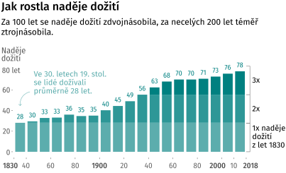
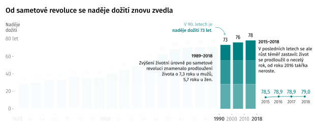

title: "Od moru ke covidu: unikátní data, jak se měnily příčiny úmrtí Čechů od císaře pána do dneška"
perex: "<i>S covidem</i>, nebo <i>na covid</i>? Na otázku, která na jaře zamotala hlavu celé civilizaci – tedy co považovat za příčinu úmrtí – hledá medicína odpověď přes sto let."
coverimg: assets/0_uvodni_ilustrace.jpg
coverimg_note: ""
styles: [https://fonts.googleapis.com/css2?family=Fira+Sans:wght@300;400;500;600]
libraries: [] #jquery, d3, highcharts, datatables
options: [] #wide, noheader (, nopic)
---

Představte si situaci: pacient, který se celoživotně léčí s cukrovkou, se nakazí koronavirem covid-19 a jeho následkem zemře. Jaká je příčina smrti? Diabetes, nebo covid?

Pod svícnem pandemie se zdá jasné, že koronavirus. Jenže bez souběžných zdravotních problémů – komorbidit – nemoc zabíjí málokdy. „Příčina úmrtí: covid-19“ je neúplná informace, která skrývá, že jde o pacienta s dlouhodobými potížemi.
 

Zdroj: <a href="https://koronavirus.mzcr.cz/wp-content/uploads/2020/11/Data-o-celkov%C3%A9-mortalit%C4%9B-a-o-p%C5%99%C3%AD%C4%8Din%C3%A1ch-%C3%BAmrt%C3%AD-pacient%C5%AF-s-covid-19.pdf">prezentace MZ ČR</a>

Opačný případ, kdy by statistika upřednostnila diabetes, zase povede k tomu, že pacient bude chybět mezi oběťmi covidu. Přitom je evidentní, že virus mu život zkrátil, často výrazně. Podle lékařů není výjimka, když virus zkrátí život o deset až dvacet let.

Statistika příčin úmrtí předpokládá, že příčina úmrtí je jen jedna, musí tedy některou zvolit. Má ale upřednostnit dlouhodobé zdravotní potíže, nebo krátkodobou intenzivní nemoc? Ať už si vybere jedno nebo druhé – což musí dělat systematicky, pokud nemají být data nahodilá – pak nutně přichází o část informace.

Nahraďte koronavirus ve zmíněném příkladu chřipkou a máte představu o dilematu, které zdravotnictví řeší přinejmenším posledních sto let. Odpověď přitom ovlivní rozvoj medicíny a rozpočty: společnost, která „dá přednost“ cukrovce, bude mít tendenci najít víc zdrojů na vývoj léků pro diabetiky; tam, kde preferují chřipku, půjdou peníze přednostně na vakcínu proti této nemoci.

Dnešní evropská medicína vybere chřipku. K vysvětlení, proč, se musíme vrátit ještě do doby, kdy byly české země součástí Svaté říše Římské a ve stínu morových ran se rodila moderní epidemiologie.

  
  
  
  
  
  
  

<h2>Od faráře k demografovi: jak se umíralo za císaře pána</h2>
<h2 class="time-span">1785 až 1918</h2>

Neuvěřitelně působí fakt, že ještě před dvěma sty lety se naši předci dožívali podobného věku jako ve středověku – průměrně méně než třiceti let. Na základě kosterních nálezů odhadují historici naději dožití v osmém století u kmenů, které žily na dnešním českém území, na 27,5 roku. O tisíc let později to bylo podle císařských dat 28,2 roku.

Když na úvod článku trochu předběhneme, během necelých dvou století se délka života protáhla z 28 na bezmála 80 let. Nešlo o plynulou změnu: jsou období jako přelom 19. a 20. století, kdy se během jedné generace život prodloužil o 40 procent, světové válce navzdory. V jiných dobách se růst délky života zpomalil nebo zastavil. V komunistických 60. letech minulého století se dokonce na celé desetiletí obrátil.

Zdroj: Vladimír Srb: 1000 let obyvatelstva českých zemí, <a href="https://www.czso.cz/csu/czso/demograficka-prirucka">Demografická příručka ČSÚ</a>

<h3>Ukazatele délky života</h3>

<i>Naděje dožití</i>, <i>střední délka života</i>, <i>očekávaná délka dožití při narození</i>. Všechny tři termíny označují totéž: jak dlouho průměrně žili ti, kteří v daném roce zemřeli. Navzdory názvu tedy neříkají nic o tom, jak dlouho budou žít ti, kteří se teprve narodili – pro takovou predikci logicky chybí data.

S délkou života úzce souvisí méně příjemný ukazatel: počet zemřelých. Nejde přímo o převrácenou hodnotu, ale s trochou zjednodušení můžeme říct, že délka dožití roste, když klesá úmrtnost. V každém historickém období se přitom příčiny úmrtí mění. Za císaře, během první republiky obklíčené válkami, za komunistické totality i po sametové revoluci rozhodovaly o délce a kvalitě života jiné nemoci, nehody nebo násilná úmrtí.

Důvod, proč začali panovníci hlídat, kolik a jak starých poddaných mají, byly války. Důvod, proč začali sledovat, na co umírají, epidemie.

V sedmnáctém století Evropu děsil mor. Z té doby pocházejí [první ručně kreslené úmrtnostní tabulky](https://en.wikisource.org/wiki/Natural_and_Political_Observations_Made_upon_the_Bills_of_Mortality_(Graunt_1676) a pokusy odhadnout dětskou úmrtnost. Jejich autor, Londýňan John Graunt, je považován za zakladatele moderní epidemiologie jako vědy o zdraví populace.

Na konci osmnáctého století, kdy vědecká novinka dorazila do Vídně, centra Svaté říše Římské, už morové rány odezněly. Místo moru teď křižovaly Evropu vlny pravých neštovic, cholery a záškrtu.

Prvními demografy byli v českých zemích kněží. _Církevní výkazy o konskribovaných duších_, jak se dokument nazýval, evidovaly v každé farnosti sňatky, narození a úmrtí od roku 1762. Jejich čísla se bohužel nedochovala.

Zmiňuje to v knize _Tisíc let obyvatelstva českých zemí_ [pozoruhodný demograf Vladimír Srb](https://encyklopedie.soc.cas.cz/w/Srb_Vladim%C3%ADr), který z historických pramenů zrekonstruoval primární data a zmapoval historické souvislosti. Z jeho publikací čerpáme v historických kapitolách.

Světská moc následovala církevní proto-demografii se zpožděním dvou desítek let. Úřední evidenci obyvatel zavedl osvícenský císař Josef II., syn Marie Terezie, patentem z roku 1784. Šlo o součást _josefínských reforem_, které měly za cíl centralizovat říši a racionalizovat vládnutí. Dalším opatřením byla povinná psí vodítka.

Patent předpokládal také vznik evidence příčin úmrtí. Primárním cílem statistiky bylo včas odhalit a zastavit epidemie, k tomu jí stačilo rozlišovat jen několik základních příčin smrti: _nemoci obyčejné (gewöhnliche), místní (Ortskrankheit)_ a _epidemické, sebevraždy, vraždy_ a _úrazy_.

„Pokud jde o epidemické nemoci, byl největší zájem věnován neštovicím a choleře,“ píše Srb. „V roce 1808 vyšel dvorský dekret, který předpisoval lékařům hlášení hromadného výskytu úmrtí v obci na stejnou, ale kteroukoliv nemoc nadřízeným úřadům. Byla to jakási primitivní epidemiologická ohlašovací služba.“

Nejstarší dochovaný dokument s příčinami úmrtí, rok 1828

Až do první světové války přesnější rozlišení příčin úmrtí chybí. Poměrně spolehlivá jsou ale data o počtu narozených a zemřelých. Z výkyvů umíme poměrně dobře odhadnout, které události život zkracovaly. O největší zuby v lince úmrtnosti se v 19. století postaraly napoleonské války, epidemie neštovic a záškrtu, a také revoluční rok 1848. Více narozených dětí po válce zase naznačuje, jak jsou v této době obě linky provázané: zemřelé bylo třeba „nahradit“ dětmi. Vysoká kojenecká a dětská úmrtnost znamenala vysokou porodnost.

Snížení úmrtnosti na konci století pak znamenalo také méně dětí – [stejný trend](https://www.irozhlas.cz/zivotni-styl/spolecnost/datova-zurnalistika-faktomluva-hans-rosling_1811270630_zlo), který v knize Faktomluva popisuje demograf Hans Rösling v souvislosti se zeměmi třetího světa.

Zdroj: Vladimír Srb: 1000 let obyvatelstva českých zemí, <a href="https://www.czso.cz/csu/czso/demograficka-prirucka">Demografická příručka ČSÚ</a>

Jedním z nejúspěšnějších období, co se týče prodloužení délky života, je přelom 19. a 20. století. Během jedné generace se – navzdory válce – život v českých zemích prodloužil o 40 procent.

Klíčem k tomuto prvnímu zlomu v délce života byl zrod veřejného zdravotnictví v 80. letech 19. století. Experiment s všeobecnou zdravotní péčí si císař nejprve otestoval v koutě říše – na Moravě. Úmrtnost na infekční nemoci se zde následně propadla na polovinu a experiment se z periferie rozšířil do průmyslových center rakouského mocnářství.

První světová válka si mezi Čechy, Moravany a Slezany vyžádala asi [200 tisíc vojenských obětí](https://www.dotyk.cz/publicistika/na-frontach-1-svetove-valky-padlo-kolem-200-tisic-cechu-odhaduje-statistik-20181113.html), které ovšem v oficiální c. a k. statistice chybí. S odhadem počtu obětí přišli historici a demografové až zpětně. Pomohly jim nepřímé metody jako sčítání vdov po padlých.

Podle Srba jsou ovšem pro české země demograficky podstatnější nepřímé oběti: odhaduje, že kvůli válce [nepřišlo na svět 910 tisíc dětí](https://www.czso.cz/csu/czso/demograficky_obraz_zemi_koruny_ceske_za_prvni_svetove_valky_v_publikaci_csu) neboli 8,8 procenta předválečné populace.

Slabé válečné ročníky se zařezávají do statistiky dodnes: důvod, proč jsou české školky několik let poloprázdné a vzápětí přeplněné, je právě rozkolísání dlouhodobě stabilní porodnosti za první světové války. Podobný problém řeší většina evropských zemí; u některých se ještě prohloubil za druhé války, nejpalčivěji nenarozenou generaci [vnímá Rusko](https://www.irozhlas.cz/zpravy-svet/rusove-proti-rusum-zeme-v-nevyhlasene-obcanske-valce_1504291200_zlo).

  
  
  
  
  
  

<h2>Od španělské chřipky k německému exodu</h2>
<h2 class="time-span">1919 až 1948</h2>

V posledním válečném roce zasáhla Evropu pandemie španělské chřipky s [násobně vyšším počtem obětí](https://www.czso.cz/documents/10180/123310412/13005320q3_salfellner.pdf/cdb4e701-2f63-4182-be7d-e8c998a9a830?version=1.1) než samotná válka. Vzápětí se úmrtnost zásadně snížila: ještě v roce 1919 zemřelo v české kotlině téměř 180 tisíc lidí, o čtyři roky později 142 tisíc. Na nižší hladině úmrtnost zůstala po většinu první republiky.

Největší zlepšení v poválečných letech zaznamenala úmrtnost na infekce a nemoci dýchací soustavy. Obojí souvisí s válečnými roky, únavou rakouského hospodářství, a hlavně právě španělskou chřipkou.

Víme to díky tomu, že Československo – v rámci loučení se se vším rakouským – spustilo revoluci také v demografii. Málo podrobnou císařskou statistiku Čechoslováci nahradili, podobně jako v řadě dalších evropských zemí, propracovanější _Mezinárodní klasifikací nemocí (MKN)_. U ní se na chvíli zastavíme: dnes, o sto let později, je totiž [základem zdravotnické statistiky celé planety](https://www.youtube.com/watch?v=tZFcoYfnwiM).

  

    

      
      
Podivné diagnózy

      

        <em>Sešlost stařecká se zblbělostí</em>, <em>zrůdnost vrozená</em>, <em>vrozený nesprávný tvar srdce</em>… Jakkoliv je téma vážné, některé diagnózy z minulosti dnes působí poněkud poeticky až humorně. Dodnes ovšem najdeme <a href="https://mkn10.uzis.cz/">na seznamu oficiálních diagnóz</a> <em>kousnutí nebo úder psem</em>, <em>uhození se o jinou osobu</em> i <em>nehodu vesmírné lodi</em>.
      

    

  

MKN vznikla roku 1893 a po úspěchu ve Spojených státech se počátkem 20. století začala usazovat v Evropě. Do té doby se systémy lišily nejen stát od státu, ale také město od města, takže statistika úmrtí často nebyla srovnatelná ani v rámci jedné země.

Autoři MKN navíc počítali s tím, že s rozvojem medicíny bude třeba klasifikaci aktualizovat – každých deset let proto chtěli zavést novou revizi s upraveným seznamem nemocí. V roce 1919, kdy statistiku zavádělo Československo, platila druhá revize, označovaná MKN-2.

Příčiny úmrtí jsou v klasifikaci sdružené do nadřazených skupin, například _infekční nemoci_ nebo _úrazy_. Přesné názvy konkrétních příčin se mezi revizemi často mění, zanikají a vznikají nebo přesunují mezi skupinami – například _stáří_ jako příčina úmrtí se během celého století přes _stařeckou sešlost_ (_s_ nebo _bez zblbělosti starobní_) a řadu dalších variant obloukem vrátilo k názvu diagnózy _stáří – senilita_. Oproti tomu nadřazené třídy příčin většinou zůstávají stabilní. Umožňují tak srovnávat úmrtnost od roku 1919 dodnes.

GRAF: Top diagnózy a skupiny podle MKN

Zdroj: <a href="https://www.czso.cz/csu/czso/zemreli-podle-podrobneho-seznamu-pricin-smrti-pohlavi-a-veku-v-cr-1919-2005-a95l7hehjg">Zemřelí podle podrobného seznamu příčin smrti, pohlaví a věku, ČSÚ</a>

<h3>Hrubá míra úmrtnosti</h3>

<a href="https://www.czso.cz/csu/czso/zemreli-podle-podrobneho-seznamu-pricin-smrti-pohlavi-a-veku-v-cr-1919-2005-a95l7hehjg">Zdrojová data o příčinách úmrtí</a> ukazují, kolik na jakou příčinu zemřelo lidí. Pokud bychom je pouze spojili do časové řady, abychom ukázali trendy v příčinách úmrtí, narazíme na problém: po roce 1938 přišlo Československo o pohraničí a s ním o část obyvatel. Ze statistik tak zmizely Sudety, s nástupem protektorátu pak i Němci ve vnitrozemí. V absolutních počtech úmrtí je proto po roce 1938 schodek.

Proto se počet úmrtí obvykle srovnává s počtem obyvatel území: výsledný ukazatel se nazývá <i>hrubá míra úmrtnosti</i>, ukazuje počet úmrtí na tisíc obyvatel a schodek odstraňuje.

GIF: absolutní počty úmrtí - hrubá míra úmrtnosti

<h3>Standardizovaná úmrtnost</h3>

Zároveň se v první polovině 19. století rychle měnila věková struktura: v roce 1920 měli navrch mladí, téměř polovina Čechoslováků měla do 25 let. Během dalších třiceti let ale populace zestárla: o čtvrtinu přibylo seniorů.

To má logicky vliv i na statistiku úmrtí. V mladší populaci jsou častěji příčinou úmrtí dětské nemoci, násilná úmrtí nebo nehody, ve starší populaci nemoci srdce a rakovina.

Data mají ukazovat změny v úmrtnosti, ne ve věkové struktuře. Proto se u časových řad nebo srovnání více území ještě <i>věkově standardizují</i>: příčiny úmrtí se sledují optikou neměnného věkového rozložení, v našem případě posledního roku časové řady. Grafy tedy budou ukazovat příčiny úmrtí, <i>jako by v celém období platila věková struktura posledního roku řady</i>.

GIF: hrubá míra úmrtnosti - standardizovaná úmrtnost

Prvnímu období, kdy jsou pro české území dostupná podrobná data o příčinách úmrtí, dominují světové války. Období jsme ohraničili zlomovým rokem 1948 – i když v našem případě jde o trochu jiný mezník, než o kterém se obvykle v souvislosti s tímto rokem mluví. Víc prozradíme v další části textu.

<wide>
  

    

      <h3>Vývoj úmrtí 1919-1948</h3>
      

        Od konce první světové války do únorového převratu klesla úmrtnost o třetinu: z 2034 na 1324 úmrtí na 100 000 obyvatel.
      

    

    

      <h3>22 skupin příčin úmrtí</h3>
      

        Příčiny úmrtí se v tomto období seskupují do 16 skupin přirozených úmrtí: nemocí, vrozených vad, novorozenecké úmrtnosti i stáří. Vedle nich statistika ukazuje externí příčiny úmrtí jako vraždy, sebevraždy, dopravní nehody nebo náhodné úrazy.
      

    

    

      <h3>Stařecká sešlost</h3>
      

        V roce 1919 zemřelo s diagnózou <em>stařecká sešlost</em> 28 487 lidí (XXX stand.), o třicet let později 5&nbsp;185 lidí (XXX stand.). Neznamená to, že by v českých zemích ubylo sešlých starců – jen tolik, že během první republiky se zpřesnila statistika. Stáří jako příčinu úmrtí lékaři obvykle uváděli, pokud neznali přesný důvod.
      

    

    

      <h3>Posun v léčbě tuberkulózy</h3>
      

        V poválečných letech byly největší hrozbou infekční nemoci. Nejobávanější byla tuberkulóza – mezi infekcemi měla na svědomí 60 až 70 procent úmrtí a zabíjela v každém věku, včetně dětského. Během první republiky se podařilo úmrtnost na infekce díky lepší zdravotní péči a lepší výživě snížit na třetinu.
      

    

    

      <h3>Šiřící se obezita</h3>
      

        Okamžik, kdy nemoci srdce přebraly prvenství v úmrtnosti od infekčních nemocí, je pro medicínu důležitý. U tuberkulózy je ochranným faktorem obezita; u nemocí srdce je naopak riziková. V následujících letech proto ubylo například inzerátů na bonbóny, po kterých spolehlivě ztloustnete.
      

    

    

      <h3>Civilizační choroby</h3>
      

        Rapidní prodloužení života znamenalo vyšší úmrtnost na civlizační choroby; typicky nemoci oběhové soustavy a rakovinu. Nemoci srdce se mezi příčinami úmrtí objevily poprvé v roce 1895, ve dvacátých letech už šlo o nejčastější příčinu.
      

    

    

      <h3>Oběti 2. světové války</h3>
      

        Během válečných let dvakrát prudce přibylo násilných úmrtí: v roce 1942 během heydrichiády eviduje oficiální statistika 1 790 popravených. Ještě kritičtější byl konec války, kdy při vojenských akcích zemřelo asi 14 tisíc civilních osob. Přibylo také obětí úrazů, dopravních nehod, vražd a sebevražd. V datech chybí ti, které evidovaly německé úřady: deportované osoby i německá část populace.
      

    

    

      <h3>Ženy vs. muži</h3>
      

        Typickými civilními oběťmi války byli chlapci a muži mezi desíti a třiceti lety. U heydrichiády je poměr mužských a ženských obětí asi 8:1, u osvobozovacích bojů 3:1.
      

    

    

      <h3>Proklikejte si</h3>
      

        Nyní si sami můžete prohlédnout kompletní data.
      

    

    

      <svg class="priciny-umrti-pribehy-viz prvni-republika-pribehy-viz"></svg>
    

  

</wide>

Podrobnější pohled prozradí věk válečných obětí, nebo v čem je zákeřná tuberkulóza.

Zdroj: <a href="https://www.czso.cz/csu/czso/zemreli-podle-podrobneho-seznamu-pricin-smrti-pohlavi-a-veku-v-cr-1919-2005-a95l7hehjg">Zemřelí podle podrobného seznamu příčin smrti, pohlaví a věku, ČSÚ</a>

<h3>Dopočítávání německé populace</h3>

Téměř celá časová řada mezi lety 1919 a 2018 ukazuje příčiny úmrtí v českých zemích: tedy za Čechy, Moravu a Slezsko. Výjimkou jsou válečné roky 1938 až 1944, kdy jsou k dispozici pouze data za Protektorát Čechy a Morava, navíc bez německých státních příslušníků. V roce 1945 se do dat vrací pohraničí, ale ne Němci.

Podobně děravá jsou válečná data o počtu obyvatel podle věku, která potřebujeme pro výpočet úmrtnosti. K dispozici jsou pouze do roku 1938 a znovu od roku 1945. Tento údaj proto ve válečných letech pouze odhadujeme, mezi oběma hraničními roky předpokládáme lineární změnu počtu obyvatel v každé pětileté věkové skupině.

Úmrtnost během války je tedy pouze odhad. Trendy nicméně navazují na okolní roky a zlomy jsou jen u skupiny <i>válečné akce a soudní poprava</i>, kde odrážejí skutečnost.

Podobně jako za první světové války chyběli ve statistice vojáci, během druhé světové války v ní nejsou oni ani deportovaní. Opět se musíme spolehnout na archivy.

„Ztráty českého obyvatelstva – padlí, popravení, zahynulí v koncentračních táborech – byly vyčísleny na 55 tisíc osob, tedy 0,7 procenta obyvatel české národnosti v roce 1938,“ shrnuje své pátrání v archivech demograf Vladimír Srb. „Ztráty židovského obyvatelstva představovaly 75 tisíc osob (63,6 procenta osob židovského vyznání), ztráty romského etnika se vyčíslují počtem pět tisíc jedinců (83,3 procenta osob romského etnika).“

Na frontě podle demografa zahynulo také 190 tisíc československých Němců a dalších 25 tisíc zemřelo při poválečných odsunech.

Na rozdíl od první světové války ovšem nedošlo k většímu propadu porodnosti ani nárůstu úmrtnosti – u české populace se v době protektorátu obě čísla rozkolísala, ale dlouhodobé trendy se nezměnily.

  
  
  
  
  
  

<h2>Pivo, bůček, cigarety: temná éra pro srdce</h2>
<h2 class="time-span">1949 až 1989</h2>

I po druhé světové válce následovala éra, kdy úmrtnost padala a věk se prodlužoval: díky antibiotikům – a později také očkování – se povedlo vymýtit strašidlo dětské tuberkulózy, spály nebo záškrtu. Podobný průběh se odehrál v celé Evropě a většině industrializovaných zemí.

Jenže na rozdíl od západu Evropy Československu optimismus dlouho nevydržel.

„Nejpříznivějších ukazatelů úmrtnosti bylo v Česku dosaženo na začátku 60. let,“ analyzuje vývoj Srb. „Celé Československo a hlavně Česko ztratilo zejména v letech politické normalizace někdejší předstih a zařadilo se mezi země s nejvyšší úmrtností a nejnižšími ukazateli střední délky života (_v Evropě, pozn. red._).“

„Rostla úmrtnost na civilizační choroby, jako jsou nemoci oběhové soustavy a novotvary, protože vývoj léků kardiovaskulárních nemocí a vývoj cytostatik (_léků na ničení nádorových buněk, pozn. red._) nepřinášel předpokládané rychlé pozitivní účinky,“ pokračuje. „Úmrtnost v českých zemích neodpovídala vysoké úrovni českého zdravotnictví. Jeho efekty byly nižší než prostředky do něho vynakládané. Nelze pochybovat, že se na tom podílela i situace ekonomická a psychosociální.“

Zdroj: Vladimír Srb: 1000 let obyvatelstva českých zemí, <a href="https://www.czso.cz/csu/czso/demograficka-prirucka">Demografická příručka ČSÚ</a>

Optikou příčin úmrtí se 20. století dělí na období do roku 1948 a období po něm. V tomto roce, na švu mezi pátou a šestou revizí, proběhl radikální řez: výrazně se proměnilo uspořádání diagnóz do skupin, změnila se také logika sledování vnějších příčin úmrtí – kromě otázky, _jak_ k němu došlo, přibyl anatomický pohled, _jaká část těla_ byla poraněna. Fakt, že zároveň s touto revolucí rozdělil 20. století také komunistický puč, je sympatická náhoda; umožňuje odděleně sledovat vývoj úmrtnosti ve starém a novém politickém režimu.

Hlavní změna – tedy z pohledu statistiky – se ale týká otázky, co považovat za hlavní příčinu úmrtí.

Úmrtí obvykle nepřichází ze dne na den, je výsledkem vývoje, řetězce příčin. Na počátku takového řetězce může být relativně nevinný zdravotní problém, například _vysoký tlak_, na konci _srdeční infarkt_. Lékař, který pacienta ošetřoval a vyplňuje takzvaný _list o prohlídce zemřelého_, vyplní celý řetězec. Z něj pak statistik vybere jednu položku, kterou uvede jako příčinu úmrtí.

A právě způsob, jakým položku vybere, se v roce 1948 změnil. První revize MKN považovaly za rozhodující _bezprostřední příčinu úmrtí_, tedy poslední údaj v řetězci. Šestá revize, která vstoupila v platnost právě roku 1948, to změnila: nyní byl za příčinu úmrtí považován začátek řetězce. Předtím by se v našem příkladu jako příčina úmrtí objevil srdeční infarkt, po něm vysoký tlak.

List o prohlídce mrtvého z poloviny 20. století

V Československu se nová pravidla začala uplatňovat po roce 1954 a projevila se zřejmě až postupně – v žádné skupině příčin se úmrtnost nezměnila skokově.

Podobné změny se ale mohou objevit na každém švu mezi dvěma revizemi. Nejviditelnější je změna mezi sedmou a osmou revizí mezi lety 1967 a 1968. Z roku na rok přibude víc než dvacet tisíc obětí oběhových nemocí, naopak u nemocí nervové soustavy spadne úmrtnost téměř na nulu. Je to tím, že _mozkovou mrtvici_ nová klasifikace považuje za problém cév, nikoli nervů, jak tomu bylo dříve.

<!--  -->

Zdroj: <a href="https://www.czso.cz/csu/czso/zemreli-podle-podrobneho-seznamu-pricin-smrti-pohlavi-a-veku-v-cr-1919-2005-a95l7hehjg">Zemřelí podle podrobného seznamu příčin smrti, pohlaví a věku, ČSÚ</a>

Ještě jeden faktor hraje při výkladu dat podstatnou roli: podíl _nepřesně určených příčin úmrtí_. Ukazují to data z prvních let po vzniku Československa, kdy byla nejčastější příčinou úmrtí _stařecká sešlost_. V roce 1919 jí statistika připisuje 28 tisíc, tedy asi 16 procent všech úmrtí.

Pohledem současné medicíny jde o chybný údaj – lékaři by měli být schopni určit příčinu přesněji. Podobných diagnóz je přitom v klasifikacích více. Sdružují se ve zvláštní skupině diagnóz, které se nevešly jinam, pojmenované nejprve nemoci _špatně definované_, dnes _příznaky, znaky a abnormální klinické a laboratorní nálezy nezařazené jinde_.

„Statistika, v níž 20 až 25 procent příčin připadá na tuto třídu, se považuje za nekvalitní,“ upozorňuje Srb.

Československá statistika úmrtí jako celek je na tom v tomto ohledu slušně – podíl nepřesných příčin brzy spadl pod deset procent a už tam zůstal.

 

<!--  -->

Zdroj: <a href="https://www.czso.cz/csu/czso/zemreli-podle-podrobneho-seznamu-pricin-smrti-pohlavi-a-veku-v-cr-1919-2005-a95l7hehjg">Zemřelí podle podrobného seznamu příčin smrti, pohlaví a věku, ČSÚ</a>

V některých částech země se ale dařilo méně. Zatímco v české části federace bylo v padesátých letech nepřesně určených úmrtí kolem pěti procent, na Slovensku čtyřikrát tolik. Jednou z příčin byla existence takzvaných laických ohledačů: ti s určením příčiny úmrtí zastoupili lékaře, pokud se nemohl dostavit. Na Slovensku přitom třetinu úmrtí ještě v padesátých letech stanovili právě laici.

Laičtí ohledači měli tendenci přiklánět se k diagnózám, které byly „zřejmé“ – pokud neznali anamnézu zemřelého, většinou uvedli _stáří, selhání srdce_ nebo podobně nekonfliktní příčinu úmrtí.

Kritický pohled na příčiny úmrtí ale připomíná, že problém se neomezuje jen na laiky.

„Jediný způsob, jak si být _téměř_ jistý příčinou smrti, je pitva,“ [vysvětloval autorům článku](https://ihned.cz/c1-61452430-delka-zdraveho-zivota-u-nas-klesa-prodluzujeme-stonani-je-to-ekonomicka-past-varuje-lekar) před lety Jan Holčík, dlouholetý profesor sociálního lékařství na Masarykově univerzitě. „Kdybych to odhadl – a možná je můj odhad naprosto nesprávný – tak se pitvá 10 až 20 procent lidí, u všech ostatních se příčina úmrtí odhaduje na základě dřívější diagnózy.“

„V mezinárodním srovnání máme sice propitvanost jednu z největších na světě, ale nezbývá než připustit, že příčina smrti u nepitvaných pacientů, tedy u zbývajících 80 procent, je nejistá,“ pokračuje.

„Chybná data nejsou jediný problém,“ dodává Holčík. „Další nastanou při interpretaci. Je tu třeba paradox lepší diagnostiky. Když jsou onkologové tak šikovní, že si pomocí screeningu zavčasu stáhnou všechny pacienty, bude ve statistikách vyšší nemocnost a někdy i úmrtnost na nádory. Prostě proto, že se o nich ví.“

Je ale třeba dodat, že ani kritici, kteří příčiny úmrtí označují za měkká data – jako je profesor Holčík – nic nenamítají proti hlavním obrysům, které z dat vystupují. V době vlády jedné strany je to stagnace délky života a dominance civilizačních nemocí spojených s hrůzostrašným životním stylem.

<wide>
  

    

      <h3>Vývoj úmrtí 1949-1989</h3>
      

        XXX
      

    

    

      <h3>XXX</h3>
      

        Se stárnoucí populací mezi příčinami úmrtí přibývalo nemocí srdce a cév. Maxima tahle linka dosáhla v 80. letech, kdy právě sem spadalo víc než 55 procent všech úmrtí. Může za to hlavně životní styl, který za normalizace převládl: pivo, bůček a cigarety.
      

    

    

      <h3>XXX</h3>
      

        Komunistický teror 50. let se do dat propsal nárůstem obětí poprav a nejrůznějších nehod. Oficiální data ovšem neukazují nárůst sebevražednosti. Až do roku 1967 také čeští statistici pracovali s příčinou úmrtí <em>Úraz v dole nebo lomu</em>, ačkoliv jiné země ji dávno vyřadily.
      

    

    

      <h3>XXX</h3>
      

        Statistiky sebevražednosti se v celém období, alespoň oficiálně, pohybovaly pod čísly první republiky. Maxima dosáhly na konci 60. let, zřejmě i v souvislosti s vpádem vojsk Varšavské dohody. Během normalizace číslo vytrvale klesalo.
      

    

    

      <h3>XXX</h3>
      

        Díky antibiotikům a později také očkování se podařilo vymýtit dětskou tuberkulózu, radikálně snížit počty obětí tuberkulózy ve vyšším věku, spály, záškrtu, spalniček i dávivého kašle. V roce 1949 na infekce zemřelo víc než 10 tisíc lidí, o 40 let později měly čtyři stovky obětí.
      

    

    

      <h3>XXX</h3>
      

        Statistika obětí dopravy má překvapivý vývoj: nejprve jich přibývá, v roce 1969 nastane zlom a počty obětí klesnou na čísla z 50. let. Příčinou může být vyšší bezpečnost, ale také nedostupnost automobilů na konci období. Nejčastější obětí jsou v celém období chodci.
      

    

    

      <h3>XXX</h3>
      

        V 19. století tvořili třetinu mezi všemi úmrtími v českých zemích kojenci. V padesátých letech to byla desetina, v roce sametové revoluce jen půl procenta. Podobně radikálně se zlepšila mateřská úmrtnost. Jednou z příčin je přesun většiny porodů do nemocnic a zlepšení poporodní péče.
      

    

    

      <h3>Proklikejte si</h3>
      

        Nyní si sami můžete prohlédnout kompletní data.
      

    

    

      <svg class="priciny-umrti-pribehy-viz komunismus-pribehy-viz"></svg>
    

  

</wide>

  
  
  
  
  
  

<h2>Stín po železné oponě</h2>
<h2 class="time-span">1990 až 2018</h2>

Sametová revoluce ze dne na den změnila politický režim. Proměnit tak setrvačný obor jako zdravotnictví je ovšem záležitost na desítky let. Zvlášť ukazatele jako délka dožití se mění zvolna, jelikož starší generace se většinou drží svých životních návyků a zlozvyků, k nim se přidává zdravotní zátěž z minulých let.

„V medicíně je asi taková setrvačnost, jako když obracíte námořní loď,“ [podotkl v rozhovoru](https://www.irozhlas.cz/zivotni-styl/zdravi/psychiatr-uzkost-deprese-antidepresiva-spotreba-leciv-martin-anders_1811080630_jab) Martin Anders, jeden z architektů reformy psychiatrické péče.

Pivo a párek ostatně stále patří k obrazu spokojeného Čecha a <a href="https://www.vlada.cz/cz/ppov/protidrogova-politika/media/vyrocni-zprava-o-drogach-mira-uzivani-alkoholu--tabaku-nebo-konopnych-latek-zustava-v-cr-vysoka--situace-se-lepsi-u-dospivajicich-184879/" target="_blank">spotřeba alkoholu ani cigaret neklesá</a>. Dobrá zpráva je, že mladší generace pije i kouří méně. Špatná, že oba zlozvyky se tím pádem koncentrují mezi méně staršími lidmi a přibývá rizikových pijáků.

„I v polovině 90. let zaostává Česká republika za ostatními vyspělými zeměmi Evropy _(v naději dožití, pozn. red.)_ zhruba o sedm až deset kalendářních let,“ píše v publikaci _Tisíc let obyvatelstva českých zemí_ demograf Vladimír Srb.

Zdroj: <a href="https://www.youtube.com/watch?v=dQw4w9WgXcQ">Zemřelí podle podrobného seznamu příčin smrti, pohlaví a věku, ČSÚ</a>

Do devadesátých let Češi naňahňali <a href="https://cs.wikipedia.org/wiki/Druh%C3%BD_demografick%C3%BD_p%C5%99echod" target="_blank">hodnotovou revoluci</a>, která na Západě probíhá od let šedesátých.  V zemi tak během několika roků po pádu režimu stoupl věk, kdy žena povine první dítě, o pět let; první svatba se posunula o sedm let. Polovina manželství v té době končila rozvodem. Poměr dětí a seniorů se v tomto období [změnil ve prospěch seniorů](https://www.irozhlas.cz/zpravy-domov/-v-roce-1989-bylo-v-cesku-deti-skoro-dvakrat-vic-nez-senioru-pomer-se-otaci_201411100044_vkourimsky). Rychlost i rozsah změn ukazujeme v [interaktivní kalkulačce](https://www.irozhlas.cz/zpravy-domov/kalkulacka-spocitejte-si-kdy-vas-ceka-svatba-dite-rozvod-nebo-umrti_1704241238_sam).

Radikální experiment s hledáním štěstí <em>teď hned</em> se vyčerpal během nultých let, od té doby se demografické ukazatele ustálily na nové hladině.

S nástupem individualismu se zvýšila také životní úroveň a s ní délka života. Po šedivých normalizačních letech se tak život Čechů začal znovu prodlužovat. Jazykem sociální medicíny začala tranzice z <em>období degenerativních a člověkem způsobených nemocí</em> do <a href="https://www.ncbi.nlm.nih.gov/pmc/articles/PMC5429583/" target="_blank"><em>věku opožděných degenerativních onemocnění</em></a>.

Přesto je i dnes v datech o délce dožití patrné, <a href="https://interaktivni.rozhlas.cz/umrti-srdce/" target="_blank">kudy vedla železná opona</a> mezi Západem a Východem. Třicet let po pádu Berlínské zdi se rozdíl v délce dožití sice snížil na tři až pět let, ale úplnému vymazání vytrvale odolává.

Zdroj: <a href="https://ec.europa.eu/eurostat/databrowser/view/tgs00101/default/table?lang=en">Life expectancy at birth by sex and NUTS 2 region, Eurostat</a>

V čem jsou dnes hlavní rozdíly mezi zeměmi na západ a na východ od železné opony? Ve kterých příčinách úmrtí zaostáváme? Můžeme se poučit, jak se s nimi před léty vypořádaly země, které se v epidemiologických ukazatelích pokoušíme dohnat?

Od sametové revoluce se střední délka života na obou stranách opony přiblížila. V Česku je klíčový trend snižování úmrtnosti na nejčastější příčiny úmrtí – nemoci oběhové soustavy a novotvary. V jejich stínu se ale nečekaně vrací minulá rizika.

„Zatímco ‚staré‘ infekce jsou na prahu vyhubení, objevují se nové,“ [upozorňuje](https://owncloud.cesnet.cz/index.php/s/m8ngF4L6LB2L4wJ) demografka Markéta Pechholdová z katedry demografie Vysoké školy ekonomické. Jde například o bakterie rezistentní vůči antibiotikům nebo nemoci přenesené ze zvířat. Upozorňuje také na návrat nemocí, proti kterým je vakcína dostupná – spalniček, dětské obrny, záškrtu a černého kašle.

S novými infekcemi jsou spojena nová rizika. Problémy nemocí přenesených ze zvířat není potřeba představovat – zatímco epidemii netopýřího viru SARS v roce 2002 se ještě podařilo zastavit včas, prasečí chřipka v roce 2009 stála po celé planetě půl milionu životů, aktuální pandemie dosud přibližně třikrát tolik. Podobně nebezpečná je rostoucí rezistence bakterií na antibiotika: podle WHO jde o [jedno z nejpodceňovanějších zdravotních rizik](https://www.who.int/news-room/fact-sheets/detail/antimicrobial-resistance).

Oproti klasickým civilizačním nemocem navíc infekční nemoci zabíjejí v nižším věku, některé výrazně – například AIDS. Pokud bychom se tedy ptali, o kolik roků nemoc zkrátila život, infekční nemoci budou hrát větší roli než aktuální dvě procenta v celkové úmrtnosti.

Zdroj: <a href="https://www.czso.cz/csu/czso/zemreli-podle-podrobneho-seznamu-pricin-smrti-pohlavi-a-veku-v-cr-1919-2005-a95l7hehjg">Zemřelí podle podrobného seznamu příčin smrti, pohlaví a věku, ČSÚ</a>

Přes nové problémy je vývoj naděje dožití i úmrtnosti od sametové revoluce optimistický.

<wide>
  

    

      <h3>Vývoj úmrtí 1990-2018</h3>
      

        XXX
      

    

    

      <h3>XXX</h3>
      

        Nejdůležitější zpráva posledních třiceti let zní: radikálně ubylo obětí nemocí srdce a cév, jasně dominantní příčiny úmrtí. V absolutních číslech o třetinu. Ve standardizované úmrtnosti – tedy jak by se změnil počet obětí, kdyby byla věková struktura populace v celém období stejná jako v roce 2018 – spadla dokonce na 40 procent.
      

    

    

      <h3>XXX</h3>
      

        Obětí novotvarů jsou asi o čtvrtinu častěji muži než ženy. V posledních třiceti letech standardizovaná úmrtnost klesá u obou pohlaví, u mužů ale rychleji, proto se také délka života mírně srovnává. Nejčastější příčinou úmrtí ve skupině je dlouhodobě rakovina průdušky a plíce.
      

    

    

      <h3>XXX</h3>
      

        Od začátku století v datech přibývá diagnózy <em>jiná sepse</em>: bakteriální infekce, které se typicky objeví po operaci. Sepse často doprovází jinou nemoc, zřejmě tak jde o častější příčinu úmrtí, než ukazují data.
      

    

    

      <h3>XXX</h3>
      

        Sebevražednost po sametové revoluci dál klesala. Výjimkou je období po globální ekonomické krizi – v letech 2009 až 2013 se počty sebevražd na čas zvýšily.
      

    

    

      <h3>XXX</h3>
      

        Do roku 1994 pokračoval trend z minulého období: obětí dopravních nehod přibývalo. V tomto roce se na trhu objevila Škoda Fabia, v následujících letech obětí ubylo. Nejčastějšími obětmi dopravních nehod jsou nicméně stále chodci.
      

    

    

      <h3>XXX</h3>
      

        Těsně po revoluci přibývalo obětí trestných činů, po pěti letech číslo začalo klesat. Nejčastější příčinou úmrtí ve skupině je <em>napadení ostrým předmětem</em>, obětí střelných zbraní je dnes minimum.
      

    

    

      <h3>Proklikejte si</h3>
      

        Nyní si sami můžete prohlédnout kompletní data.
      

    

    

      <svg class="priciny-umrti-pribehy-viz soucasnost-pribehy-viz"></svg>
    

  

</wide>

„Nyní již máte dostatek informací, abyste mohli vydedukovat, jak to bylo doopravdy,“ zněla ikonická věta ve špatném, ale legendárním detektivním seriálu Hříchy pro pátera Knoxe z devadesátých let.

Nyní již máte dostatek informací, abyste uměli přečíst, na co Češi umírali od založení republiky do dneška. Časová řada je standardizovaná podle současné české populace – ukazuje tedy, jak by vypadaly příčiny úmrtí, kdyby byla v každém roce stejná věková struktura, jako je ta dnešní.

<wide>
  

    

      <h3>Vývoj úmrtí 1919-2018</h3>
      

        <em>Doplnit</em>
      

    

    

      <h3>24 skupin příčin úmrtí</h3>
      

        <em>Doplnit</em>
      

    

    

      <h3>Proklikejte si</h3>
      

        Nyní si sami můžete prohlédnout kompletní data.
      

    

    

      <svg class="priciny-umrti-pribehy-viz stoleti-pribehy-viz"></svg>
    

  

</wide>

  
  
  
  
  
  

<h2>Na padání vlasů by se nemělo umírat</h2>
<h2 class="time-span">Jakými pravidly se statistici řídí dnes?</h2>

Po necelém století úvah nad tím, co vlastně znamená spojení _příčina úmrtí_ a jak ji určovat, se v roce 1994 pravidla ustálila. Navzdory plánu autorů Mezinárodní klasifikace nemocí, že životnost revize je jedno desetiletí, se aktuální _MKN-10_ po celém světě používá víc než 25 let. Novou revizi částečně nahradilo druhé vydání v roce 2006, klíčová pravidla ale zůstala stejná.

Pokud se chceme vrátit k otázce, co znamená _na covid_ a s covidem, musíme je v rychlosti proletět.

Určení příčiny začíná u ošetřujícího lékaře, který po úmrtí vyplní _list o prohlídce zemřelého_. K většině úmrtí v současnosti dochází v nemocicích, kde si lékař obvykle vystačí s anamnézou zemřelého. Pokud si příčinou není jistý, může nařídit pitvu. V některých dramatických situacích to přímo nařizuje zákon.

Současná verze listu o prohlídce zemřelého

„V zásadě by ohledávající lékař měl vyslovit návrh k pitvě vždy při pochybnosti o příčině smrti u osob zemřelých náhle, u osob žijících osaměle, zemřelých mimo zdravotnická zařízení a v případě, že je nucen uvést diagnózu _příčina smrti neznámá_,“ říká [manuál pro lékaře](https://www.uzis.cz/sites/default/files/knihovna/lpm_pruvodce_2006.pdf).

První potíže mohou nastat už tady, dávno předtím, než data dostane do ruky statistik: pokud lékař nevyplní list správně, je obtížné řetězec příčin zrekonstruovat.

Statistika příčin úmrtí z lékařských zpráv vzniká u demografů ČSÚ a ÚZIS. Právě tady je gravitační jádro celého procesu.

Pro určení příčiny statistici primárně využívají první část listu: v prvním řádku lékař uvede _bezprostřední příčinu smrti_, tedy nemoc nebo úraz, které smrt způsobily. Směrem dolů se postupně odvíjí řetězec stavů, které k úmrtí postupně vedly, až k problému, který vše vyvolal.

_Základní příčina smrti_ – tedy ta, která se objeví ve statistice – je právě tento začátek řetězce stavů. To se ale nepovede vždy.

„Některé triviální příčiny, jako je například padání vlasů, by neměly vést ke smrti,“ [upozorňuje](http://www.demografie.info/?cz_detail_clanku&artclID=840) na chyby lékařů Šárka Daňková z ÚZIS, klíčová osoba pro statistiku příčin úmrtí. Právě ona zkoumá, zda lékařské zprávy mají řešení, a určuje základní příčinu.

Zdroj: <a href="https://www.uzis.cz/sites/default/files/knihovna/lpm_pruvodce_2006.pdf">Jak správně postupovat při vyplňování Listu o prohlídce mrtvého, ÚZIS</a>

Komplikace nastanou, když řetězec stavů nezapadá – například proto, že jeden z článků řetězce zkrátka nemůže vést k druhému. Pak má statistik moc základní příčinu smrti změnit. Pokouší se zrekonstruovat nový řetězec: základní příčinu hledá v druhé části listu o prohlídce zemřelého nebo se ptá ošetřujícího lékaře. Řídí se několika jednoduchými pravidly, která mají za cíl eliminovat nepřesné příčiny (pokročilý věk), triviální potíže (zmíněné vypadávání vlasů) i příliš obecné příčiny (onemocnění cév).

Jiný problém přichází v okamžiku, kdy naopak list o prohlídce zemřelého nabízí _více platných řetězců_. Z logiky věci mají stejné právo na místo ve statistice příčin úmrtí oba řetězce, epidemiologie proto musí rozhodnout arbitrárně. Přednost dostávají nemoci závažnější z pohledu veřejného zdraví, typicky epidemické nemoci – stejně jako o dvě století dříve. Detaily rozhodování popisuje téměř třísetstránková [příručka](https://www.uzis.cz/res/f/008277/mkn-10-instrukcni-prirucka-20200101.pdf).

Většina celého procesu, od dodání listu lékařem po finální statistiku, by mohla probíhat strojově. K tomu také národní úřady motivuje Eurostat – čím větší část bude automatizovaná, tím lépe budou data srovnatelná mezi zeměmi, alespoň teoreticky. Ostatně už za rok začne v Evropě platit jedenáctá revize MKN, která se mimo jiné chlubí právě [integrací online nástrojů](https://www.who.int/classifications/classification-of-diseases).

Část práce ostatně už za statistiky stroje obstarávají.

„Vytvořili jsme validační nástroj, který kontroluje vybranou základní příčinu smrti z několika hledisek, v kontextu věku a pohlaví, ale i pravděpodobnosti jejího možného výskytu,“ vysvětluje Daňková.

Nástroj se používá od roku 2007 a může částečně vysvětlovat, proč od té doby ve statistice přibývá úmrtí v některých méně zastoupených skupinách příčin. Podobný efekt může mít také zavedení automatického kódování na straně lékařů, které pomáhá vybrat příčinu a platný řetězec diagnóz od roku 2011.

„Z vývoje úmrtnosti na některé příčiny je zřejmé, že dochází ke zpřesnění a zkvalitnění statistiky,“ pokračuje Daňková. „Lze to dokumentovat klesajícím podílem zemřelých na aterosklerózu, která není doporučena ke kódování základní příčiny smrti vzhledem k tomu, že se jedná o velice generalizované, málo specifické onemocnění.“

„Významné změny se týkají také dalších příčin, jako jsou hypertenze, infarkt myokardu, cévní mozková příhoda, pneumonie a diabetes,“ dodává.

<h3>Mezinárodní srovnání</h3>

Ve Francii měl covid během jarní vlny 31 tisíc obětí. Ve Španělsku byl oficiální počet úmrtí na covid podobný, 34 tisíc, jenže celková úmrtnost se proti dlouhodobému průměru zvedla o 56 tisíc lidí.

Francie a Španělsko nejsou jediní: <a href="https://www.economist.com/graphic-detail/2020/07/15/tracking-covid-19-excess-deaths-across-countries">výsledná čísla se podstatně liší</a> v celé Evropě. Počet obětí covidu se s nárůstem úmrtnosti <a href="https://www.irozhlas.cz/zpravy-domov/celkova-umrti-listopad_2012070635_pek">rozchází také v Česku.</a>

Důvod, proč statistici doporučují pro sledování dopadů pandemie sledovat spíše druhé číslo – nárůst celkové úmrtnosti – je právě časově náročné určování příčin úmrtí, popsané v textu.

Stejnými neduhy trpí také srovnání úmrtnosti na jiné příčiny. Všechny evropské země využívají stejnou revizi MKN, tedy stejné diagnózy a podobná pravidla pro určení hlavní příčiny úmrtí. Jenže výsledná statistika ukazuje výrazné rozdíly.

„Ve Francii se podle statistik víc umírá na žaludek, v Německu na srdce,“ vypráví bývalý profesor sociálního lékařství Jan Holčík. „Není přitom moc jasné, proč. Nemusí jít vůbec o objektivní důvody, spíš o to, co jsou lékaři zvyklí uvádět jako hlavní příčinu.“

Lepší mezinárodní srovnatelnost je jeden z cílů zpřesnění příčin úmrtí.

<h2>Odpověď: ? procent úmrtí <i>s covidem</i> je <i>na covid</i></h2>

Od dubna 2020 mají lékaři i statistici k dispozici dvě diagnózy pro úmrtí na covid: _úmrtí s laboratorně prokázaným virem_ a _s klinickým nebo epidemiologickým nálezem, ale bez dostupného pozitivního testu_.

V první polovině roku je využili 407×, z toho u desetiny případů statistici našli akutní stav, který covid nezpůsobil: obvykle mozkový nebo srdeční infarkt. Říká to [prezentace ÚZIS](https://koronavirus.mzcr.cz/wp-content/uploads/2020/11/Data-o-celkov%C3%A9-mortalit%C4%9B-a-o-p%C5%99%C3%AD%C4%8Din%C3%A1ch-%C3%BAmrt%C3%AD-pacient%C5%AF-s-covid-19.pdf).

„Postup při vyhodnocování základní příčiny smrti pro účely statistické tabelace je pak ošetřen mezinárodními pokyny a pravidly, přičemž v případě covidu je obdobný jako u onemocnění chřipkou a nelze jej považovat za následek jiného stavu,“ píše se ve specifických [instrukcích pro lékaře i statistiky](https://www.uzis.cz/res/file/registry/lpz/lpz-metodika-covid-19.pdf) k této nemoci.

V systému příčin úmrtí tedy covid hraje roli „horší chřipky“, což ale není vůbec slabá pozice – infekční nemoci mají v systému poměrně vysokou prioritu. Mezi nimi je navíc covid „protekční děcko“, má přednost před ostatními.

Při prioritě infekčních nemocí obecně a covidu zvlášť by tedy měl být uveden jako příčina úmrtí všude, kde není stanoven akutní problém, to je u 90 procent případů z první poloviny roku. Novější data k tomuto úhlu pohledu zatím veřejně dostupná nejsou.

Čerstvější, ale méně přesná veřejná data mluví o XXX úmrtích s hlavní příčinou úmrtí covid-19, tedy _na covid_. Zbylá část nadměrné úmrtnosti jsou úmrtí _s covidem_, který zde ale nebyl hlavní příčinou, nebo z jiných důvodů. Souvisí zřejmě s tím, že se lékaři nemohli naplno věnovat necovidovým pacientům, vyšší sebevražedností, osamocení v sociálních zařízeních, a podobně. Z epidemiologického pohledu ale o přímé oběti covidu nejde.

Zdroj: <a href="https://www.irozhlas.cz/zpravy-domov/celkova-umrti-listopad_2012070635_pek">Eurostat/ČSÚ, MV ČR – informativní výpis z evidence obyvatel</a>

Celý koncept hlavní příčiny úmrtí s sebou nese riziko: tím, že pravidla pro výběr upřednostňují závažnější příčiny úmrtí před méně závažnými, vznikají „neviditelné“ diagnózy. Markéta Pechholdová z VŠE zmiňuje například _septikémie_ neboli _sepse_: bakteriální infekce, které se mohou objevit třeba po operaci. Sepse doprovází úmrtí na jinou příčinu, která má v pravidlech vyšší prioritu – podle demografky se proto mezi příčinami úmrtí objevují vzácněji, než odpovídá jejich skutečné roli. Zdravotnictví je podle ní podceňuje.

Způsobem, jak podobné diagnózy zviditelnit, je změna uvažování nad tím, co je příčina úmrtí. Hledání jediné příčiny může být relikt minulosti, kdy bylo zpracování i vizualizace dat obtížné. Přirozenější je uvažovat o více příčinách, které působí společně. Koncept se nazývá _sdružené příčiny úmrtí_.

Mimochodem, nejde o novinku.

„Také u nás jsme třídili a v letech 1925 až 1937 publikovali tabulky s kombinovanými příčinami smrti,“ píše demograf Vladimír Srb. „Avšak později pro nákladnost třídění a poměrně malé využití dat bylo od třídění upuštěno.“

O téměř sto let později se vynořují nápady sdružené příčiny úmrtí rehabilitovat. Mohlo by jít o elegantní odpověď na otázku, zda _na covid_, nebo _s covidem_. Obojí.

